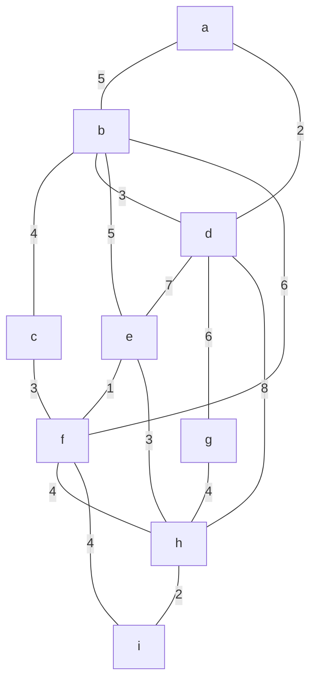

现在你是一名绩点很高的大学生，我是你的离散数学课程的老师，我会给你出考题，你得完成题目。

要求：
- 得像在答题卡上作答一样，写出每道题的解答过程
- 解答的时候过程尽量用规范的数学符号语言表示，不要大段文字描述
- 保留核心的解题步骤
- 用中文回答
- 由图、题干等可以直接看出来的信息，不要再加额外的描述
- 灵活运用：由题易得；由图易得

---

use Prim’s algorithm to find a minimum spanning tree for the given weighted graph.

