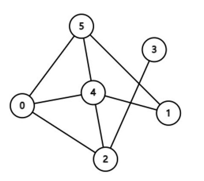
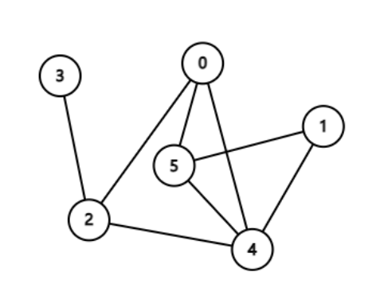
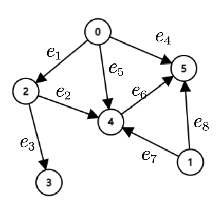
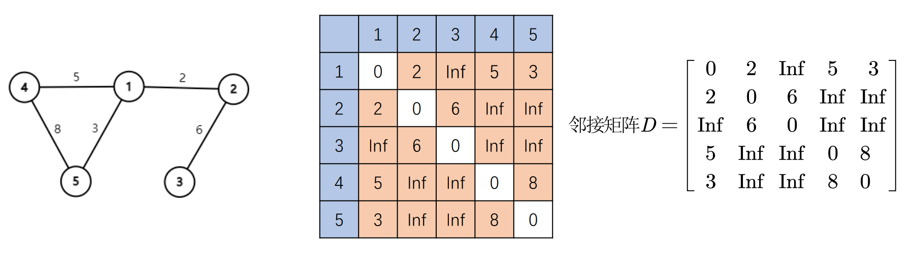

<h1 align='center'>图论与最短路径算法</h1>


## 图

[图：在线直观图](https://csacademy.com/app/graph_editor/)

### 图的定义

对于平面上的**若干点**,把这些点用曲线或直线**连接起来**,**不考虑**点的**位置**与连线的曲直**长短**,这样形成的关系结构就是图.

例如以下两张图就是同一个图。（把节点抽象出来只剩下数据）


​				


### 图的分类

- 有向图（节点之间用箭头连接）
- 无向图（节点之间用直线连接）（如上图所示）


### 图的表示方法

数学语言描述为 $$G(V(G),E(G))$$ 。$$V(vertex)$$ 代表图的顶点集（顶点的集合），$$E(edge)$$ 表示图的边集（边的集合）。



顶点集 $$V=\{0,1,2,3,4,5\}$$ ，边集 $$E=\{e_1,e_2,e_3,e_4,e_5,e_6,e_7,e_8\}$$ 


### 图的数据结构

- 通过节点来建立方形矩阵（节点个数*节点个数）
- 矩阵之中的值的表示节点之间的距离
- 矩阵数值应该是关于（n, n）对称的
- 不确定的距离（没有线连接的节点之间）为 inf（无穷）



## 最短路径算法	

### 迪杰斯特拉算法

思路参考B站视频：[最短路径 迪杰斯特拉 dijkstra算法 数据结构与算法](https://www.bilibili.com/video/BV1QESyYGE55?vd_source=b6e1ca78539fba73d35a26224eac9099)

代码参考ChatGPT


```python
import heapq
from typing import Dict, List, Tuple


def dijkstra_with_letters():
    """
    使用 Dijkstra 算法计算最短路径，动态输入节点（使用字母表示）和边的信息。

    输入:
    1. 节点总数 `node_count`。
    2. 节点名称（字母表示，例如 A, B, C...）。
    3. 节点之间的边和权重，格式为: A B s (节点名称 + 权重)，输入 'end' 表示结束。
    4. 起始节点（字母表示）。

    输出:
    从起始节点到所有其他节点的最短路径距离。
    """
    # 输入节点总数
    node_count = int(input("请输入节点总数: "))

    # 输入节点名称
    print("请输入节点名称（用字母表示，例如 A, B, C...）:")
    nodes = [input(f"节点 {i + 1}: ").strip() for i in range(node_count)]

    # 创建节点名称到索引的映射
    node_to_index = {node: idx for idx, node in enumerate(nodes)}
    index_to_node = {idx: node for idx, node in enumerate(nodes)}

    # 初始化图的邻接表
    graph: Dict[int, List[Tuple[int, int]]] = {i: [] for i in range(node_count)}

    # 动态输入边的信息
    print("请输入节点之间的边和权重 (格式: A B s)。输入 'end' 表示结束输入。")
    while True:
        edge = input("输入: ").strip()
        if edge.lower() == "end":
            break
        try:
            a, b, s = edge.split()
            weight = int(s)
            if a in node_to_index and b in node_to_index:
                i, j = node_to_index[a], node_to_index[b]
                graph[i].append((j, weight))
            else:
                print("节点名称不存在，请重新输入。")
        except ValueError:
            print("输入格式错误，请重新输入。")

    # 输入起始节点
    start_node = input("请输入起始节点（例如 A）: ").strip()
    if start_node not in node_to_index:
        print("起始节点不存在。")
        return
    start_index = node_to_index[start_node]

    # 初始化最短距离字典
    shortest_distances = {i: float('inf') for i in graph}
    shortest_distances[start_index] = 0  # 起始节点到自身的距离为 0

    # 最小堆（优先队列），存储 (距离, 节点索引)
    priority_queue = [(0, start_index)]

    # 记录已访问节点
    visited = set()

    # 核心 Dijkstra 算法
    while priority_queue:
        # 弹出距离最小的节点
        current_distance, current_node = heapq.heappop(priority_queue)

        # 如果节点已访问，跳过
        if current_node in visited:
            continue

        # 标记节点为已访问
        visited.add(current_node)

        # 遍历当前节点的邻居
        for neighbor, weight in graph[current_node]:
            distance = current_distance + weight
            # 如果找到更短路径，更新最短距离并加入队列
            if distance < shortest_distances[neighbor]:
                shortest_distances[neighbor] = distance
                heapq.heappush(priority_queue, (distance, neighbor))

    # 输出结果
    print("\n从节点 {} 到所有其他节点的最短路径距离:".format(start_node))
    for node_index, dist in shortest_distances.items():
        node_name = index_to_node[node_index]
        if dist == float('inf'):
            print(f"节点 {node_name} 无法到达")
        else:
            print(f"到节点 {node_name} 的最短距离: {dist}")


# 调用函数
dijkstra_with_letters()

```

