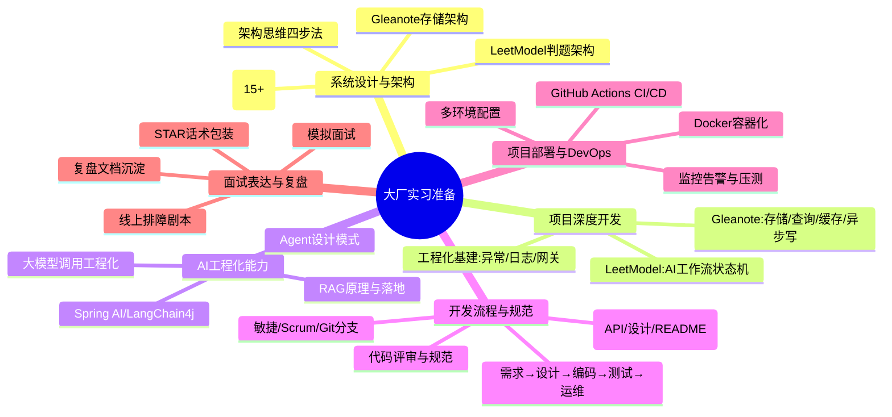
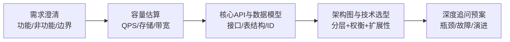
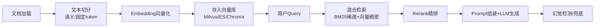
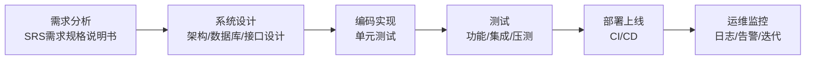
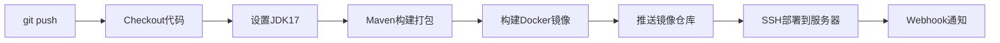

你的反馈非常精准。一份能拿下大厂实习的准备，绝不能只停留在"写Demo+背八股"，必须覆盖**系统设计思维、AI工程化、标准开发流程、团队协作、DevOps部署、自我复盘**这六大维度——这些恰恰是区分"学生玩具"和"企业级项目"的分水岭。

下面是一份**目标导向的完整准备清单**，不绑定时间线，只给你"该做哪些、做到什么程度、如何在面试中讲出来"。

---

## 一、整体准备地图

先用一张图把六大模块的全貌和你两个项目（Gleanote / LeetModel）的落点铺开，后续每个模块都会展开成具体任务清单。

六大模块之间是**"做项目 → 沉淀经验 → 包装话术 → 面试输出"**的闭环。下面逐个模块拆解任务清单。

---

## 二、模块一：系统设计与架构准备（你的核心优势区）

大厂面试已从"背八股"转向"现场设计分布式系统"，2025-2026年高频场景题集中在秒杀、短链、Feed流、排行榜、分布式ID、网关等方向。你临场逻辑强、有架构思维，这是你的差异化武器，必须重点打磨。

### 1. 通用场景设计题库（覆盖大厂高频）

下表是建议你逐个预演的题目清单，每道题都要能做到"需求拆解 → 容量估算 → 核心API → 架构图 → 技术选型权衡"五步走。

| 题目                | 核心考点                                          | 与你项目的关联        |
| ------------------- | ------------------------------------------------- | --------------------- |
| 短链系统            | Base62发号器、缓存、302重定向、高并发读           | 通用高频，必练        |
| 秒杀系统            | Redis预减库存、MQ削峰、限流降级、防超卖           | 并发+缓存综合题       |
| 微博/朋友圈Feed流   | 推模式/拉模式/推拉结合、读扩散写扩散              | Gleanote内容分发      |
| 排行榜/热榜         | Redis ZSet、小顶堆、实时TopN                      | LeetModel提交排行     |
| 站内消息系统        | WebSocket、未读数统计、消息队列                   | Gleanote通知          |
| 分布式ID生成器      | Snowflake、时钟回拨、号段模式                     | 两个项目主键设计      |
| 大文件分片上传      | 分片、断点续传、秒传、合并                        | Gleanote附件/导入     |
| 在线判题系统        | Docker沙箱、cgroups资源限制、超时中断、防恶意代码 | **LeetModel直接对标** |
| 协同编辑系统        | OT/CRDT、版本号乐观锁、Diff同步、历史回滚         | **Gleanote直接对标**  |
| 知识库问答系统(RAG) | 文档切分、Embedding、向量检索、Rerank、幻觉兜底   | Gleanote AI方向       |
| 限流系统            | 令牌桶/漏桶、滑动窗口、分布式限流、Sentinel       | 两个项目通用          |
| 分布式锁            | Redis Redlock、Zookeeper、数据库锁                | 库存/笔记并发写       |
| 延时任务系统        | Redis ZSet、时间轮、RocketMQ延时消息              | LeetModel重试补偿     |
| 动态线程池          | 参数动态调整、监控告警、优雅停机                  | LeetModel工作流       |
| API网关             | 路由、鉴权、限流、日志、协议转换                  | **你上次面试盲区**    |
| 分布式配置中心      | 配置推送、灰度、回滚、监听                        | 工程化加分项          |

### 2. 架构思维四步法（每道题都按这个套路练）

**关键心法**：面试官评估的不是你背了多少方案，而是你能否说出"为什么选A不选B、什么场景下A会崩、未来怎么演进"。比如短链系统，初级回答是"Base62+Redis"，工程级回答要能讲"发号器时钟回拨怎么处理、热点短链怎么缓存、冷数据怎么归档、短链失效怎么清理"。

### 3. 两个项目的架构图（必须画出来能讲）

- **Gleanote 存储架构**：本地文件层 ⇄ 同步引擎 ⇄ 在线存储层（MySQL元数据 + 内容表 + Redis缓存 + 向量库检索），突出"离/在线格式对齐"和"多级缓存"。
- **LeetModel 判题架构**：网关 → 提交队列 → 调度器 → Docker沙箱池 → 结果回写 → AI评审工作流，突出"资源隔离"和"异步编排"。

---

## 三、模块二：项目深度开发（承接上一轮的两大战役）

这一块是上一轮已明确的Gleanote存储优化 + LeetModel AI工作流升级，这里只做**任务清单的收口**，不重复展开细节。

### Gleanote 后端核心模块（存储优化方向）

| 子模块       | 要做什么                                                     | 面试能讲什么                                |
| ------------ | ------------------------------------------------------------ | ------------------------------------------- |
| 数据模型设计 | 元数据/正文物理分离；Markdown AST统一解析；离线`.md`与在线DB双向同步 | 冷热分离、格式对齐、同步冲突解决            |
| 查询优化     | 联合索引+最左前缀；游标分页替代深度分页                      | 索引下推ICP、`LIMIT offset`深度分页性能塌方 |
| 多级缓存     | Caffeine本地缓存 + Redis分布式缓存；缓存空值防穿透、随机TTL防雪崩 | 缓存三大件、多级缓存一致性                  |
| 异步写架构   | 高频保存先入Redis，定时线程池批量刷盘                        | 写吞吐提升、保护DB、批量合并                |

### LeetModel AI评审工作流引擎

| 子模块       | 要做什么                                           | 面试能讲什么               |
| ------------ | -------------------------------------------------- | -------------------------- |
| 工作流状态机 | 拆分静态分析→逻辑评审→优化建议；状态落库、断点恢复 | 异步编排、幂等、可恢复     |
| 重试补偿     | Spring Retry指数退避；死信队列；人工介入标记       | 分布式不确定性、最终一致性 |
| 限流降级     | Redis+Lua令牌桶；AI不可用时降级为本地静态分析      | 熔断降级、成本控制         |
| 线程池编排   | CompletableFuture串联步骤；IO密集型参数调优        | JUC实战、拒绝策略          |

### 工程化基建（补齐你上次面试的盲区）

这一项是你上次面试直接被问倒的部分，必须补齐：

| 盲区              | 要做什么                                              | 面试能讲什么         |
| ----------------- | ----------------------------------------------------- | -------------------- |
| 全局异常+统一响应 | `@RestControllerAdvice`+统一响应体含traceId           | 规范化、前端友好     |
| MDC链路追踪       | 拦截器生成traceId放入MDC，全链路日志串联              | 线上排障、可观测性   |
| API网关           | Spring Cloud Gateway统一路由+Token鉴权                | 网关职责、微服务边界 |
| 压测与排障        | JMeter压测；`top -Hp`+`jstack`+`jmap`演练CPU 100%/OOM | 真实调优闭环         |

---

## 四、模块三：AI工程化能力（2026面试新增考察点）

2026年部分大厂团队已开始考察AI工程化方向，传统后端仍为主流但AI是加分项。你两个项目都涉及AI，这块必须从"调API"升级到"工程化落地"，才能讲出深度。

### 1. RAG原理与工程化（Gleanote AI方向）

**必练考点**：RAG vs 微调的区别与选型、文档切分策略（语义分块 vs 固定token）、Embedding模型选型、Rerank作用、HNSW索引原理、检索质量评估、bad case处理。

**面试话术方向**："我在Gleanote里设计了基于RAG的笔记智能检索，文档切分用语义分块避免割裂上下文，检索用BM25+向量混合召回再Rerank，对检索为空的情况做了'知识库未命中不编造'的兜底。"

### 2. Agent设计模式（LeetModel AI工作流方向）

**必懂概念**：ReAct模式（推理+行动循环）、Plan-then-Execute（先规划后执行，强制隔离决策与数据）、Function Calling、MCP协议（模型上下文协议，大模型的"USB接口"）、短期记忆与长期记忆、防止无限循环、Prompt注入防御。

**面试话术方向**："LeetModel的AI评审我用Plan-then-Execute模式，先让模型生成固定的工具调用序列再执行，避免它被不可信数据带偏；用Spring AI做编排，Tool层封装代码分析能力。"

### 3. 大模型调用的工程化（后端工程师的差异化优势）

这部分是你作为后端开发最该讲深的地方——算法工程师在Notebook里跑通单次调用，你要解决的是生产级问题：

| 工程问题        | 解决方案                                      |
| --------------- | --------------------------------------------- |
| 接口超时/不稳定 | 重试+指数退避+熔断降级                        |
| 高并发刷量      | Redis令牌桶限流                               |
| Token成本失控   | 语义缓存（相似Query命中缓存）、Prompt压缩     |
| 首字延迟体验差  | 流式输出（SSE）优化TTFT                       |
| 上下文超长      | 会话分块、摘要压缩、滑动窗口                  |
| 输出不可控      | 结构化输出（JSON Schema）、结果校验、幻觉兜底 |

### 4. 技术栈选型

- **Spring AI**：Java生态零门槛切入点，适合你现有技术栈
- **LangChain4j**：编排层核心引擎，Chain/Tool/Memory串联
- **向量库**：Milvus（生产级）/ Elasticsearch（已有就复用）/ Chroma（轻量demo）
- **大模型**：DeepSeek（你已在用）/ Qwen，关注多模态弱项的替代方案

---

## 五、模块四：开发流程与工程规范（补齐"产品全链路"认知）

你上次面试反思里写得很对——"得真正上升到线上产品的维度，从idea到发布上线的完整链路"。软件开发标准流程是：**需求分析 → 设计 → 编码 → 测试 → 部署 → 运维**，每个阶段都有对应文档和角色。

### 1. 标准开发流程认知

**你要能讲清楚的点**：
- 每个阶段的输入/输出文档是什么（需求规格说明书、技术方案设计书、接口文档、测试报告）
- 敏捷开发与瀑布模型的区别，大厂普遍用Scrum（每日站会+迭代发布）
- 你在个人项目里如何模拟这套流程（即使一个人也要走一遍）

### 2. 团队协作与文档体系（你上次被问"有产出哪些文档"没答好）

| 文档类型            | 工具             | 你的项目要产出什么                      |
| ------------------- | ---------------- | --------------------------------------- |
| 需求文档            | Markdown/语雀    | Gleanote功能需求清单、LeetModel评审需求 |
| 系统设计文档        | Markdown+架构图  | 架构图、表结构设计、技术选型说明        |
| API文档             | Swagger/OpenAPI  | 所有接口的路径/参数/返回值              |
| README              | GitHub           | 项目介绍、技术栈、启动方式、架构图      |
| CHANGELOG           | keep-a-changelog | 版本迭代记录                            |
| ADR（架构决策记录） | Markdown         | 关键技术选型的决策原因（面试王炸）      |

### 3. Git协作规范

- **分支模型**：main（生产）/ develop（集成）/ feature-xxx（功能）/ hotfix-xxx（修复）
- **Commit规范**：`feat: 新增AI评审限流` / `fix: 修复深度分页慢查询` / `docs: 补充架构文档`
- **PR/MR流程**：代码评审、CI自动检查、合并触发部署
- **面试话术**："我的项目用Git Flow分支模型，feature分支开发完提PR，GitHub Actions自动跑单测和构建，通过后合并到main触发部署。"

### 4. 代码规范与评审

- 遵循《阿里巴巴Java开发手册》：命名、异常处理、日志规范
- 单元测试覆盖核心逻辑（JUnit5 + Mockito）
- 面试可讲："我给核心模块写了单元测试，CI流水线里会自动跑，测试不通过阻断合并。"

---

## 六、模块五：项目部署与DevOps（补齐"从没跑通CI/CD"的硬伤）

你明确说过"Docker不熟练、CI/CD没跑通"，这是大厂实习生的基本要求，必须亲手跑通一次完整链路。

### 1. Docker容器化

| 任务           | 要做到什么程度                                               |
| -------------- | ------------------------------------------------------------ |
| 编写Dockerfile | 多阶段构建（Maven编译→JRE运行），镜像瘦身                    |
| Docker Compose | 一键启动应用+MySQL+Redis，本地开发环境一致                   |
| 镜像管理       | 推送到阿里云容器镜像服务或GHCR                               |
| 面试话术       | "用Docker解决环境一致性问题，Compose编排多容器，告别'在我机器上能跑'" |

### 2. GitHub Actions CI/CD流水线

这是最轻量、最适合个人项目的CI/CD方案，一条流水线打通：

**具体要配置的**：
- `.github/workflows/ci-cd.yml`：push到main触发
- Secrets管理：服务器SSH密钥、镜像仓库密码、API Key
- 构建产物：Spring Boot JAR + Docker镜像
- 部署方式：SSH登录服务器拉取新镜像重启，或Webhook触发Watchtower自动更新

### 3. 多环境配置管理

- `application-dev.yml` / `application-test.yml` / `application-prod.yml`
- 用Spring Profile切换，敏感配置用环境变量或配置中心
- 面试话术："我做了多环境配置隔离，开发用本地DB，生产用云DB，通过Profile和环境变量切换，密钥不进代码仓库。"

### 4. 监控告警与日志收集

| 维度 | 方案（实习生够用即可）                                     |
| ---- | ---------------------------------------------------------- |
| 日志 | Logback按天滚动 + MDC traceId，后续可讲ELK思路             |
| 监控 | Spring Boot Actuator暴露健康检查；讲Prometheus+Grafana思路 |
| 告警 | 讲思路：日志Error阈值、接口超时率、CPU/内存阈值触发告警    |
| 压测 | JMeter对核心接口压测，记录QPS/响应时间/错误率              |

---

## 七、模块六：面试表达与自我复盘（发挥你的临场优势）

你临场表达有逻辑、有自信，这是天赋，但要配合"有料的经历"才能转化成Offer。

### 1. STAR法则包装项目话术

每个项目亮点都按 **Situation（场景）→ Task（任务）→ Action（行动）→ Result（结果，最好量化）** 包装：

> ❌ 错误："我用Spring Boot做了笔记系统，接了AI。"
>
> ✅ 正确："Gleanote的AI总结接口响应慢（3-10s），高频调用会堆积请求（S）。我需要保证接口可用性并控制API成本（T）。我把同步调用改为线程池异步处理，并用Redis令牌桶做用户级限流，AI不可用时降级为本地静态分析（A）。改造后接口吞吐量提升数十倍，单用户限流10次/分钟，API成本下降40%（R）。"

### 2. 线上排障剧本（必背，面试高频）

把项目里"故意制造的坑"包装成排障经历，背熟排查口诀：

| 故障现象     | 排查路线                                                     |
| ------------ | ------------------------------------------------------------ |
| CPU 100%     | `top`查进程 → `top -Hp`查线程 → `jstack`看堆栈 → 找死循环/频繁GC |
| OOM内存溢出  | `jmap -dump`导出堆 → MAT分析大对象 → 定位内存泄漏            |
| 接口突然变慢 | 看链路traceId日志 → 查DB慢查询/Redis命中率/线程池水位        |
| 死锁         | `jstack`查线程状态 → 找BLOCKED线程 → 分析锁等待链            |

### 3. 自我复盘文档（你已有这个习惯，继续强化）

你上次面试的复盘写得非常好，这种习惯要延续。建议为每个项目维护一份**项目复盘文档**，包含：
- 技术决策记录（为什么选A不选B）
- 踩过的坑与解决方案（面试素材库）
- 量化指标（QPS、响应时间、成本）
- 遗留问题与改进方向（体现你的反思深度）

面试前再维护一份**面试复盘文档**：每次模拟面试或真实面试后，记录被问的问题、答得好/差的点、下次改进方向。

### 4. 模拟面试

- 用AI扮演面试官，针对你的简历做2-3轮完整模拟
- 重点演练：项目深挖连环追问、现场系统设计题、手撕代码讲解
- 录音回放，优化语速、逻辑词、停顿

### 5. 简历精修

按STAR法则重写Gleanote和LeetModel，每个项目3-4条bullet，每条都是"问题+方案+量化结果"。RMDB内核比赛单独一段，突出底层原理理解。把"AI工程化""CI/CD""分布式"等关键词自然融入，但每句话都要有真实细节支撑。

---

## 八、执行优先级建议

六大模块不必齐头并进，按"**投入产出比**"排序：

1. **第一优先**：项目深度开发（模块二）+ 系统设计题库（模块一）——这是面试的核心战场，直接决定能否过技术面。
2. **第二优先**：AI工程化（模块三）+ 工程化基建（异常/日志/网关/压测）——你的差异化亮点，也是补齐上次面试盲区。
3. **第三优先**：DevOps部署（模块五）+ 开发流程规范（模块四）——跑通一次CI/CD即可，文档体系顺手沉淀。
4. **贯穿始终**：面试表达与复盘（模块六）——边做项目边积累话术，不要等到最后才包装。

你的判断是对的——**面向真实面试要求准备，适可而止，有真实经历、能力达标即可**。每一个Demo模块都要问自己三个问题：数据量到百万会崩吗？接口被刷1万次会死吗？报错了能查到吗？带着这三个问题写代码，你的项目就能直接对标大厂实习要求。

