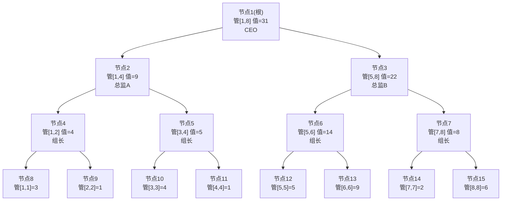

# 线段树 (Segment Tree) 完全教程

---

## 一、场景与动机 — 为什么要学线段树？

### 1.1 它解决什么问题？

假设你有一个很长的数组，你需要反复做两件事：

- **查询**：问"第 L 个到第 R 个元素的总和是多少？"（区间求和）
- **更新**：把第 i 个元素的值改成新值（单点修改）

这类需求在实际中非常常见，比如：
- LeetCode 307. 区域和检索 - 数组可修改
- LeetCode 315. 计算右侧小于当前元素的个数（需要动态统计）
- 竞赛中：区间最大值查询、区间最小值查询、区间乘积查询
- 实际工程：排行榜分数更新 + 区间排名查询、监控系统的区间统计

不只是求和，任何**可合并**的操作都可以——求和、求最大值、求最小值、求乘积、求最大公约数等等。只要你能把两个小区间的结果"合并"成大区间的结果，线段树就能做。

### 1.2 朴素做法：直接遍历

最简单的方式——用数组存数据：

```
查询[2, 5]的和：for (int i = 2; i <= 5; i++) sum += arr[i];   → O(n)
更新arr[3]：arr[3] = newVal;                                    → O(1)
```

单个查询 O(n)。如果有 m 次查询，总时间就是 O(nm)。当 n = 100,000，m = 100,000 时，就是一亿亿次操作，直接超时。

### 1.3 前缀和：查询很快，但更新很慢

前缀和可以 O(1) 查询任意区间和：

```
前缀和预处理：prefix[i] = arr[1] + arr[2] + ... + arr[i]
查询[L, R]：prefix[R] - prefix[L-1]  → O(1)，非常快
更新arr[i]：需要重新计算 prefix[i] 到 prefix[n]，→ O(n)
```

**问题：** 只要有一个元素改了，后面所有前缀和全都要重算。查询多、更新也多的时候，前缀和吃不消。

### 1.4 差分数组：更新很快，但查询很慢

差分数组可以 O(1) 做区间加法（注意是加法，不是改值）：

```
更新[L, R] 全部加 x：diff[L] += x; diff[R+1] -= x;  → O(1)
查询arr[i]：需要求 diff[1] + ... + diff[i]  → O(n)
```

**问题：** 查询某个区间就慢了，和朴素做法一样。而且差分数组更擅长"区间加"，对于单点赋值和区间求和不是最合适的。

### 1.5 对比总结

| 方法 | 单点更新 | 区间查询 | 最佳场景 |
|------|---------|---------|---------|
| 朴素数组 | O(1) | O(n) | 几乎不用 |
| 前缀和 | O(n) | O(1) | 只有查询，没有更新 |
| 差分数组 | O(1) 区间加 | O(n) | 只有区间更新，少量查询 |
| **线段树** | **O(log n)** | **O(log n)** | **查询和更新都频繁** |

线段树做到了**查询和更新都是 O(log n)**，当两种操作都很频繁时，线段树是最佳选择。代价是代码比较复杂，需要 O(n) 的预处理建树和约 4n 的额外空间。

> **一句话总结：** 线段树是一种**平衡**的艺术——它不追求某一项操作最快，而是让所有操作都保持在 O(log n)，在查询和更新混合的场景下综合性能最优。

---

## 二、原理讲解 — 线段树到底是怎么做到的？

### 2.1 核心比喻：层层汇总的管理系统

想象你是一家大公司的 CEO，有 8 个员工，编号 1 到 8，每人有一个业绩数字。

作为 CEO，你不可能每天追着 8 个人一个个问业绩。所以你建立了一个管理层级：

```
         ┌─────────────────────────────┐
         │     CEO (管1-8，总业绩)     │  ← 最顶层，汇总全局
         └──────────┬──────────────────┘
           ┌────────┴────────┐
    ┌──────┴──────┐   ┌──────┴──────┐
    │ 总监A (1-4) │   │ 总监B (5-8) │   ← 中间层，各管一半
    └──────┬──────┘   └──────┬──────┘
      ┌────┴────┐       ┌────┴────┐
   ┌──┴──┐   ┌──┴──┐  ┌──┴──┐  ┌──┴──┐
   │ 1-2 │   │ 3-4 │  │ 5-6 │  │ 7-8 │  ← 基层管理
   └──┬──┘   └──┬──┘  └──┬──┘  └──┬──┘
     ┌┴┐       ┌┴┐      ┌┴┐      ┌┴┐
    │1││2│    │3││4│   │5││6│   │7││8│  ← 一线员工(原始数据)
    └─┘└─┘    └─┘└─┘   └─┘└─┘   └─┘└─┘
```

- CEO 不直接管员工，而是问总监：你管的那片业绩总和是多少？
- 总监也不直接管员工，而是问基层管理：你手下那两个人业绩总和是多少？
- 基层管理者直接从员工那里获取数据

**这个管理层级就是线段树。** 树的每个节点负责管理**一段区间**，叶子节点是原始数据（一个员工），中间节点存的是它**下属区间的汇总值**（如总和）。

> **关键洞察：** 查询任意区间时，不需要把区间内的每个叶子都找出来——只需要找到能**完全覆盖**这段区间的几个管理者，把他们的数据汇总就行。这就是 O(log n) 的秘诀。

### 2.2 具体例子：建树过程

假设原数组是 `[3, 1, 4, 1, 5, 9, 2, 6]`（下标从 1 开始），我们建一棵**区间求和**的线段树。

**第一步：把数组元素放到叶子节点**

```
叶子节点（第3层）:
    [3]   [1]   [4]   [1]   [5]   [9]   [2]   [6]
下标 1     2     3     4     5     6     7     8
```

**第二步：从下往上，逐层汇总**

```
第3层(叶子):    [3]    [1]    [4]    [1]    [5]    [9]    [2]    [6]
                  \    /        \    /        \    /        \    /
第2层:             [4]           [5]           [14]           [8]
                  (3+1)         (4+1)          (5+9)         (2+6)
                     \            /               \            /
第1层:                     [9]                          [22]
                          (4+5)                        (14+8)
                             \                            /
第0层(根):                                [31]
                                         (9+22)
```

建树后，树中每个节点存的是它**管辖区间的总和**。这就是线段树的本质：**把大区间拆成小区间，每个小区间的结果提前算好存起来**。

### 2.3 线段树的树形结构可视化



> **看图说明：**
> - 每个节点上的数字（如"节点2"）是**节点编号**，不是节点存的值。节点编号用于在数组中定位节点。
> - `管[i,j]` 表示这个节点负责原数组下标 i 到 j 的区间。
> - `值=XX` 是这个节点存的区间总和。
> - 父子关系：节点 k 的左儿子编号是 2k，右儿子编号是 2k+1。

### 2.4 查询操作：怎样 O(log n) 找到任意区间？

假设要查询区间 `[2, 6]` 的总和（即元素 1 + 4 + 1 + 5 + 9 = 20）。

思想：**从根节点出发，判断当前节点管辖的区间和目标查询区间的关系。**

三种情况：

```
情况1：当前节点区间 完全在 查询区间内  → 直接返回这个节点的值
情况2：当前节点区间 完全在 查询区间外  → 不用往下找了，返回0
情况3：当前节点区间 部分重叠         → 继续往下递归到左右子节点
```

**逐步跟踪查询 [2, 6] 的过程：**

```
从根节点1开始：管[1,8]，值=31
  查询区间[2,6] 和 [1,8] 是部分重叠 → 情况3，要往下递归

  递归到左儿子 节点2：管[1,4]，值=9
    查询区间[2,6] 和 [1,4] 是部分重叠 → 情况3，继续往下递归

    递归到 节点4：管[1,2]，值=4
      查询区间[2,6] 和 [1,2] 是部分重叠 → 情况3

      递归到 节点8：管[1,1]，值=3
        [1,1] 完全在 [2,6] 之外 → 情况2，返回 0

      递归到 节点9：管[2,2]，值=1
        [2,2] 完全在 [2,6] 之内 → 情况1，返回 1  ← 命中！

      节点4的结果 = 0 + 1 = 1

    递归到 节点5：管[3,4]，值=5
      [3,4] 完全在 [2,6] 之内 → 情况1，直接返回 5  ← 完全命中！不用再往下

    节点2的结果 = 1 + 5 = 6

  递归到右儿子 节点3：管[5,8]，值=22
    查询区间[2,6] 和 [5,8] 是部分重叠 → 情况3

    递归到 节点6：管[5,6]，值=14
      [5,6] 完全在 [2,6] 之内 → 情况1，直接返回 14  ← 命中！

    递归到 节点7：管[7,8]，值=8
      [7,8] 完全在 [2,6] 之外 → 情况2，返回 0

    节点3的结果 = 14 + 0 = 14

  根节点结果 = 节点2结果 + 节点3结果 = 6 + 14 = 20 ✓
```

**纯文本方式跟踪整个查询路径（用缩进表示递归层级）：**

```
query(node=1, l=1, r=8, ql=2, qr=6)     ← 当前管[1,8]，查[2,6]
│  [1,8] 和 [2,6] 部分重叠 → 左右都递归
│
├─ query(node=2, l=1, r=4, ql=2, qr=6)  ← 当前管[1,4]，查[2,6]
│  │  [1,4] 和 [2,6] 部分重叠 → 左右都递归
│  │
│  ├─ query(node=4, l=1, r=2, ql=2, qr=6) ← 当前管[1,2]
│  │  │  [1,2] 和 [2,6] 部分重叠 → 左右都递归
│  │  │
│  │  ├─ query(node=8, l=1, r=1): [1,1] ⊄ [2,6] → 返回 0
│  │  ├─ query(node=9, l=2, r=2): [2,2] ⊂ [2,6] → 返回 1  ← 命中
│  │  └─ 返回 0+1 = 1
│  │
│  ├─ query(node=5, l=3, r=4): [3,4] ⊂ [2,6] → 直接返回 5 ← 整段命中！
│  │
│  └─ 返回 1+5 = 6
│
├─ query(node=3, l=5, r=8, ql=2, qr=6)  ← 当前管[5,8]
│  │  [5,8] 和 [2,6] 部分重叠 → 左右都递归
│  │
│  ├─ query(node=6, l=5, r=6): [5,6] ⊂ [2,6] → 直接返回 14 ← 整段命中！
│  ├─ query(node=7, l=7, r=8): [7,8] ⊄ [2,6] → 返回 0
│  └─ 返回 14+0 = 14
│
└─ 最终结果 = 6 + 14 = 20
```

> **关键点：** 这次查询只递归访问了部分节点。节点 5 和节点 6 因为"完全覆盖"，直接返回其预存的值，不需要再往下递归到叶子。这就是 O(log n) 的来源——每层最多访问 4 个节点，树高 O(log n)，因此总复杂度 O(log n)。

### 2.5 更新操作：改一个数，沿途更新所有上级

假设把原数组下标 3 的值从 4 改成 `9`。

**思想：** 从根出发，找到下标 3 对应的叶子节点，更新叶子的值，然后**原路返回，更新沿途所有父节点**。

```
update(node=1, l=1, r=8, idx=3, val=9)    ← 从根开始，找下标3

判断：idx=3 在左半区 [1,4] 还是右半区 [5,8]？
  → 3 在左半区，进入左儿子

├─ update(node=2, l=1, r=4, idx=3, val=9)
│  判断：idx=3 在左半区 [1,2] 还是右半区 [3,4]？
│    → 3 在右半区，进入右儿子
│
│  ├─ update(node=5, l=3, r=4, idx=3, val=9)
│  │  判断：idx=3 在左半区 [3,3] 还是右半区 [4,4]？
│  │    → 3 在左半区，进入左儿子
│  │
│  │  ├─ update(node=10, l=3, r=3, idx=3, val=9)
│  │  │  到达叶子节点！l==r==3，直接修改：tree[10] = 9
│  │  │  返回
│  │  │
│  │  └─ 回到节点5，重新汇总：tree[5] = tree[10] + tree[11] = 9 + 1 = 10
│  │     返回
│  │
│  └─ 回到节点2，重新汇总：tree[2] = tree[4] + tree[5] = 4 + 10 = 14
│     返回
│
└─ 回到根节点1，重新汇总：tree[1] = tree[2] + tree[3] = 14 + 22 = 36
   返回
```

更新后，受影响的节点只有**从叶子到根路径上**的那些父节点。这些路径长度为 O(log n)，所以更新也是 O(log n)。

**更新前后对比：**

```
更新前:  arr = [3, 1, 4, 1, 5, 9, 2, 6]
         根 = 31, 节点2 = 9, 节点5 = 5, 节点10 = 4

                      ┌─ 更新下标3：4 → 9 
                      │                      
更新后:  arr = [3, 1, 9, 1, 5, 9, 2, 6]                    
         根 = 36 ↑, 节点2 = 14 ↑, 节点5 = 10 ↑, 节点10 = 9 ↑
```

> **注意：** 只有路径上的节点的值变了。节点 4 管 [1,2] 不受影响，节点 6、7 管 [5,8] 也不受影响。这正是线段树高效的来源——只需更新 O(log n) 个节点。

### 2.6 效果总结

| 操作 | 朴素数组 | 前缀和 | 线段树 |
|------|---------|--------|--------|
| 建树/预处理 | 无 | O(n) | O(n) |
| 单点更新 | O(1) | O(n) | **O(log n)** |
| 区间查询 | O(n) | O(1) | **O(log n)** |
| 额外空间 | 无 | O(n) | O(4n) |

线段树的核心思想就是经典的**空间换时间**：用约 4 倍的额外空间，存储预计算好的区间汇总值，把查询和更新都降到 O(log n)。

> **领悟：** 线段树不是神奇的魔法，它的本质就是"提前算好一些中间结果存起来，查询时直接拿"。和前缀和一样是预处理，但线段树的预处理结果组织成了树形结构，所以更新时可以只修改受影响的路径，不用全量重算。

---

## 三、源码实现 — Java 代码逐函数讲解

### 3.1 代码框架（仅声明，不含实现）

先看清楚整体结构——有哪些成员变量、哪些函数、各自负责什么。每个函数的具体实现会在后面逐个讲解。

```java
public class SegmentTree {
    // ========== 成员变量 ==========
    private int[] tree;   // 线段树数组，存每个节点的区间汇总值
    private int[] arr;    // 原始数组（下标从1开始）
    private int n;        // 原始数组的元素个数

    // ========== 构造函数 ==========
    public SegmentTree(int[] nums) { // 见 3.4 节讲解 }

    // ========== 建树 ==========
    private void build(int node, int l, int r) { // 见 3.5 节讲解 }

    // ========== 单点更新（对外接口）==========
    public void update(int idx, int val) { // 见 3.7 节讲解 }

    // ========== 单点更新（内部递归）==========
    private void update(int node, int l, int r, int idx, int val) { // 见 3.7 节讲解 }

    // ========== 区间查询（对外接口）==========
    public int query(int ql, int qr) { // 见 3.6 节讲解 }

    // ========== 区间查询（内部递归）==========
    private int query(int node, int l, int r, int ql, int qr) { // 见 3.6 节讲解 }

}
```

一眼能看出来：对外接口（`update(idx,val)`、`query(ql,qr)`）参数简洁，内部递归函数带有 `node, l, r` 等线段树节点信息。外部调用者不需要知道树是怎么存的，也不需要知道节点编号——这就是**封装**。

### 3.2 数据结构定义 — 成员变量

```java
private int[] tree;   // 线段树数组
private int[] arr;    // 原始数组
private int n;        // 元素个数
```

| 变量 | 类型 | 含义 |
|------|------|------|
| `tree` | `int[]` | 线段树的存储数组。`tree[node]` 表示编号为 `node` 的节点所管辖区间的汇总值（这里是区间和） |
| `arr` | `int[]` | 原始数据的副本，**下标从 1 开始**。`arr[i]` 就是第 i 个原始元素 |
| `n` | `int` | 原始数组的元素个数 |

**为什么自己存一份 arr？**

可以直接用 tree 的叶子节点取值，但保留一份 arr 更方便：
- 更新时知道原值是多少
- 某些场景需要直接读取原始元素
- 更清晰的逻辑分离：tree 存汇总，arr 存原始值

### 3.3 函数结构总览

| 函数 | 作用 | 可见性 |
|------|------|--------|
| `SegmentTree(int[] nums)` | 构造函数，初始化数组并调用 build 建树 | public |
| `build(node, l, r)` | 递归建树，自底向上填充 tree 数组 | private |
| `update(idx, val)` | 对外更新接口：把下标 idx 的值改成 val | public |
| `update(node, l, r, idx, val)` | 内部递归更新，找到叶子并沿途重算 | private |
| `query(ql, qr)` | 对外查询接口：返回区间 [ql, qr] 的区间和 | public |
| `query(node, l, r, ql, qr)` | 内部递归查询，分三种情况处理 | private |

设计模式：对外接口屏蔽递归细节（用户不需要知道线段树内部用节点编号、用区间范围），内部重载函数处理递归逻辑。用户只需要知道 `update(3, 9)` 是把第 3 个元素改成 9，不需要知道这对应树上的节点 10。

### 3.4 构造函数 — 初始化

```java
public SegmentTree(int[] nums) {
    this.n = nums.length;
    // 原数组从下标1开始用，所以长度 n+1（下标0闲置）
    this.arr = new int[n + 1];
    // 线段树开4倍空间，细节见下文
    this.tree = new int[4 * n + 1];

    // 把 nums 拷贝到 arr，注意下标偏移：nums[0] → arr[1]
    for (int i = 0; i < n; i++) {
        arr[i + 1] = nums[i];
    }
    // 从根节点1开始建树，根节点管辖整个区间 [1, n]
    build(1, 1, n);
}
```

**重点说明：**

**Q: 为什么 arr 和 tree 的下标从 1 开始，不从 0 开始？**

这是线段树实现中最常见的一个设计选择。原因在于**父子节点的编号关系**：

```
左儿子编号 = 父节点编号 × 2      →  node * 2
右儿子编号 = 父节点编号 × 2 + 1  →  node * 2 + 1
```

如果根节点编号是 1：
- 左儿子 = 2，右儿子 = 3
- 节点 2 的左儿子 = 4，右儿子 = 5
- 节点 3 的左儿子 = 6，右儿子 = 7
- 完美！公式 `left = node*2, right = node*2+1` 始终成立

如果根节点编号是 0：
- 左儿子应该是 0？0×2=0，那就死循环了
- 得用 `left = node*2+1, right = node*2+2`，公式不够简洁
- 并且 0×2+1=1 和之前所有公式都不一样，容易搞混

所以从 1 开始纯粹是为了**子节点计算公式简单直观**。这是一个工程上的约定，不是数学上的必须。

**Q: 为什么 tree 数组大小要开 4 倍？**

线段树是一棵**完全二叉树**（除了最后一层）。对于 n 个叶子节点的完全二叉树：
- 如果 n 刚好是 2 的幂次，总节点数是 `2n - 1`（满二叉树）
- 如果 n 不是 2 的幂次，最坏情况下总节点数接近 `4n - 1`

用更直观的方式理解：线段树的倒数第二层最多有 n 个节点（每个都是一个叶子的小区间），这一层往上的所有层的节点总数不超过这一层，所以整棵树的节点数不超过 `n + n + n/2 + n/4 + ... ≈ 4n`。因此开 4 倍空间是安全的保险做法。

实际常开 `4 * n + 5` 或 `4 * n + 1`，多几个位置防越界。

### 3.5 build() — 递归建树

```java
private void build(int node, int l, int r) {
    if (l == r) {
        // 终止条件：区间只剩一个元素 → 到达叶子节点
        tree[node] = arr[l];
        return;
    }
    int mid = (l + r) >> 1;                     // 取区间中点
    build(node * 2, l, mid);                    // 递归建左子树
    build(node * 2 + 1, mid + 1, r);            // 递归建右子树
    tree[node] = tree[node * 2] + tree[node * 2 + 1]; // 汇总左右子节点结果
}
```

**参数含义（逐一说清楚）：**

| 参数 | 含义 | 注意 |
|------|------|------|
| `node` | 当前节点在 tree 数组中的**编号** | 这是节点编号，不是节点存的值！根节点编号是 1 |
| `l` | 当前节点**管辖的区间左端点**（原数组下标） | 闭区间，包含 l |
| `r` | 当前节点**管辖的区间右端点**（原数组下标） | 闭区间，包含 r |

**为什么递归终止条件是 `l == r` 而不是 `l >= r`？**

因为每次都是精确的二分——`[l, mid]` 和 `[mid+1, r]`，区间长度在严格缩小。当 `l == r` 时，区间只剩一个元素，这就是叶子节点，不需要再分了。正常情况下不可能出现 `l > r`。

**为什么用 `(l + r) >> 1` 而不是 `(l + r) / 2`？**

位运算 `>> 1` 和整数除法 `/ 2` 对于非负整数效果一样，但位运算理论上更快。需要注意：如果 l+r 可能溢出（当 l 和 r 都是接近 int 最大值时），更安全的写法是 `l + (r - l) / 2`。但在算法竞赛的通常数据范围下（n ≤ 2×10⁵），`(l + r) >> 1` 足够了。

**建树的时间复杂度为什么是 O(n) 而不是 O(n log n)？**

虽然调用 build 看起来像递归 O(log n) 层 × 每层 O(n) 个节点，但叶子节点数量是 n，中间节点总共也就约 2n 个，每个节点只被访问一次。总操作次数 ≈ 2n，所以是 O(n)。

用前面的例子跟踪 `build(1, 1, 8)`：

```
build(1, 1, 8)
├─ build(2, 1, 4)
│  ├─ build(4, 1, 2)
│  │  ├─ build(8, 1, 1)  → tree[8] = arr[1] = 3
│  │  └─ build(9, 2, 2)  → tree[9] = arr[2] = 1
│  │  └─ tree[4] = 3+1 = 4
│  └─ build(5, 3, 4)
│     ├─ build(10, 3, 3) → tree[10] = arr[3] = 4
│     ├─ build(11, 4, 4) → tree[11] = arr[4] = 1
│     ├─ tree[5] = 4+1 = 5
│     └─ tree[2] = 4+5 = 9
├─ build(3, 5, 8)
│  ... (类似)
└─ tree[1] = tree[2] + tree[3] = 9 + 22 = 31
```

> **关键理解：** `build` 的顺序是**先递归到底，再回来汇总**（后序遍历）。叶子节点先被填好，然后它们的父节点才能加起来。这就是为什么 tree 数组是自底向上被填充的。

### 3.6 query() — 区间查询

对外接口：
```java
public int query(int ql, int qr) {
    return query(1, 1, n, ql, qr);
}
```

内部递归：
```java
private int query(int node, int l, int r, int ql, int qr) {
    // 情况2：当前节点区间完全在查询区间外 → 返回0（对求和没有贡献）
    if (r < ql || l > qr) {
        return 0;
    }
    // 情况1：当前节点区间完全在查询区间内 → 直接返回预存的值
    if (ql <= l && r <= qr) {
        return tree[node];
    }
    // 情况3：部分重叠 → 拆成左右两半分别查，再合并
    int mid = (l + r) >> 1;
    int leftSum  = query(node * 2, l, mid, ql, qr);
    int rightSum = query(node * 2 + 1, mid + 1, r, ql, qr);
    return leftSum + rightSum;
}
```

**参数含义（容易混淆，务必分清楚）：**

| 参数 | 含义 | 谁的范围 | 在递归中是否变化 |
|------|------|----------|-----------------|
| `node` | 当前节点的编号 | — | 每次递归改变 |
| `l` | 当前节点**管辖的区间左端点** | 当前节点 | 每次递归缩小 |
| `r` | 当前节点**管辖的区间右端点** | 当前节点 | 每次递归缩小 |
| `ql` | **目标查询区间**的左端点 | 用户给定 | **一直不变！** |
| `qr` | **目标查询区间**的右端点 | 用户给定 | **一直不变！** |

> **最容易搞混的点：`l, r` 和 `ql, qr` 是完全不同的东西。**
> - `l, r`：跟着递归走，表示"我现在走到哪个节点，这个节点管哪一段"，每次都变小
> - `ql, qr`：用户一开始指定的目标区间，在递归全程中**始终不变**
>
> 可以这样记：`l, r` 是动态变化的"我管哪"，`ql, qr` 是固定的"我要查哪"。

**判断条件的含义——画图理解三种情况：**

```
             ql       qr
              ├────────┤     ← 目标查询区间
     [l--r]                  ← 完全不相交（r < ql）→ 返回 0
          [l--r]             ← 完全不相交（l > qr）→ 返回 0
                  [l--r]     ← 完全不相交（r < ql）→ 返回 0
        [l-------r]          ← 完全覆盖（ql <= l && r <= qr）→ 返回 tree[node]
          [l--r]             ← 完全覆盖 → 返回 tree[node]
       [l-----r]             ← 部分重叠 → 继续递归
            [l-----r]        ← 部分重叠 → 继续递归
```

**为什么"完全覆盖"的判断是 `ql <= l && r <= qr`？**

翻译成人话：当前节点的左边界 l 不比 ql 更左（即 l >= ql，写成了 ql <= l），而且当前节点的右边界 r 不比 qr 更右（即 r <= qr）。意思就是当前节点管的那段完全被目标区间包住了，不需要往下拆，直接用。

**为什么"完全不相交"的判断是 `r < ql || l > qr`？**

翻译成人话：我的右边界还够不到你的左边界（r < ql），或者我的左边界已经超过了你的右边界（l > qr）。这两种情况下我俩完全碰不到一起。

**为什么用 `<` 和 `>` 而不是 `<=` 和 `>=`？**

考虑两个相邻区间 [1, 2] 和 [3, 4]：
- 查询 [1, 2] 走到管 [3, 4] 的节点：r=4, ql=1 → `4 < 1` 为 false（不相交）；l=3, qr=2 → `3 > 2` 为 true（确实不相交）✓
- 如果用 `r <= ql`：`4 <= 1` 为 false，也没问题，因为 `l > qr` 即 `3 > 2` 仍然为 true

实际上 `r < ql` 和 `r <= ql - 1` 效果一样（因为区间端点是整数）。用 `<` 更直接地表达了"完全不相交"的语义。

**返回 0 的含义：**

当查询区间和当前节点区间完全不重叠时，这一部分对"求和"没有任何贡献，返回 0。如果线段树是做最大值查询，则返回 `Integer.MIN_VALUE`（确保不会影响 max 的结果）。这个"不相交时的返回值"取决于线段树支持的运算：

| 运算 | 不相交时的返回值 |
|------|-----------------|
| 求和 | 0 |
| 求最大值 | Integer.MIN_VALUE |
| 求最小值 | Integer.MAX_VALUE |
| 求乘积 | 1 |
| 求 GCD | 0 |

### 3.7 update() — 单点更新

对外接口：
```java
public void update(int idx, int val) {
    update(1, 1, n, idx, val);
}
```

内部递归：
```java
private void update(int node, int l, int r, int idx, int val) {
    if (l == r) {
        // 到达目标叶子节点：l == r == idx
        tree[node] = val;
        arr[idx] = val;   // 同步更新原数组（非必须，但方便调试）
        return;
    }
    int mid = (l + r) >> 1;
    if (idx <= mid) {
        update(node * 2, l, mid, idx, val);        // 目标在左子树
    } else {
        update(node * 2 + 1, mid + 1, r, idx, val); // 目标在右子树
    }
    // 递归返回后，当前节点的值需要重新汇总（因为子节点可能变了）
    tree[node] = tree[node * 2] + tree[node * 2 + 1];
}
```

**参数含义：**

| 参数 | 含义 |
|------|------|
| `idx` | 要更新的元素在原数组中的下标（从 1 开始） |
| `val` | 新的值 |
| `node, l, r` | 和 build/query 一样：当前节点编号、管辖区间范围 |

**关键理解：为什么更新叶子后要重算所有祖先？**

```
假设更新 arr[3]（对应叶子节点10）：

tree[10] ← 叶子，直接改成新值
tree[5]  ← 父节点（管 [3,4]），需要重算 = tree[10] + tree[11]
tree[2]  ← 再往上的祖先（管 [1,4]），重算 = tree[4] + tree[5]
tree[1]  ← 根（管 [1,8]），重算 = tree[2] + tree[3]
```

所有受影响的节点就是**从叶子到根路径上的节点**，共 O(log n) 个。

这个"递归回来时重算"的模式是线段树的核心模式：

```java
// 核心模式：先递归下去修改，然后返回时重算当前节点
update(左或右儿子);              // 找到目标叶子并修改
tree[node] = 合并(左儿子, 右儿子); // 修改后，父节点的汇总值必须更新
```

> **易错点：** 如果忘了写 `tree[node] = tree[node*2] + tree[node*2+1]` 这行，更新的影响就只到叶子节点为止，再往上查区间和就会得到旧值。这是线段树最常见的 bug 之一。

**是否一定要同步更新 arr？**

```java
arr[idx] = val;  // 这行
```

如果你后续只通过 tree 来查询，不通过 arr 来查，那么 arr 不更新也可以。但为了调试和语义清晰，一般同步更新。多一行赋值不花什么时间，但能避免很多困惑。

### 3.8 补充：区间最值线段树

上面的代码是"区间求和 + 单点更新"。如果改成"区间最大值查询 + 单点更新"，只需要改两个地方：

```java
// build 中的汇总：
tree[node] = Math.max(tree[node * 2], tree[node * 2 + 1]);

// update 中的汇总：
tree[node] = Math.max(tree[node * 2], tree[node * 2 + 1]);

// query 中不相交的返回值：
if (r < ql || l > qr) {
    return Integer.MIN_VALUE;  // 因为要找最大值，返回最小值确保不影响结果
}
// 汇总改为：
return Math.max(leftMax, rightMax);
```

其他逻辑完全一样。这说明线段树是一个**框架**——核心的分治思路是通用的，改变"合并规则"和"不相交返回值"就能适配不同的需求。这也是为什么理解和还是最大值不重要，重要的是理解分治和汇总的结构。

### 3.9 补充：常见变体 — 懒惰标记（Lazy Propagation）

上面的线段树只支持**单点更新**。如果需要**区间更新**（如把 [L, R] 中每个元素都加 x），如果沿用上面的思路，每次要把区间内所有叶子都更新一遍，复杂度 O(n log n)，太慢了。

**懒惰标记**的思想是：更新到某个节点时，如果这个节点的区间完全在更新范围内，就给它打一个标记（lazy tag），意思是"这个节点管辖的所有元素全体要加 x"，然后**不继续往下递归了**。等到以后有查询需要经过这个节点时，再把标记往下推（pushdown）。这样区间更新也是 O(log n)。

这是线段树最常用的进阶变体。相关 LeetCode 题目如 699. 掉落的方块。

---

## 四、自检提问 — 你真的懂了吗？

> 下面是一组自检问题。请用你自己的话口头回答每一题。
> 如果你能流畅地讲出来，说明你真的理解了。
> 如果某个问题卡住了——别急着往下看答案，回到教程对应章节再看一遍。
> 记住：能讲给别人听，才是真的懂。

### 基础理解

**Q1：** 用自己的话描述，线段树是用来解决什么问题的？什么场景下会用线段树，而不用前缀和或差分数组？

**Q2：** 线段树为什么能做到查询和更新都是 O(log n)？核心思想是什么？用一句话概括。

**Q3：** 线段树的"树"存的是什么？叶子节点存什么？非叶子节点存什么？

### 建树过程

**Q4：** 从 `build(1, 1, n)` 开始，描述一下建树的递归过程。递归终止条件是什么？为什么到 `l == r` 就停了？

**Q5：** 为什么建树的时间复杂度是 O(n)，而不是直觉上的 O(n log n)？尝试用节点数量来解释。

**Q6：** 为什么线段树数组大小要开 4 倍？如果不确定，大概说下是怎么估算出来的。

### 查询过程

**Q7：** 查询函数中的 `l, r` 和 `ql, qr` 分别是什么意思？它们有什么区别？为什么 `ql, qr` 在递归中不变？

**Q8：** 查询时分为哪三种情况？每种情况怎么处理？为什么不全递归到叶子逐个取？

**Q9：** 如果要查询的区间刚好等于根节点管辖的整个区间 `[1, n]`，查询会怎么执行？需要递归几层？

**Q10：** 如果查询的区间是 `[2, 2]`（单个元素），查询会经历怎样的递归路径？最终在哪个节点返回结果？

### 更新过程

**Q11：** 单点更新后，为什么只需要更新从叶子到根路径上的节点？和这个路径无关的节点为什么不需要更新？

**Q12：** 更新操作中，递归返回后为什么要执行 `tree[node] = tree[node*2] + tree[node*2+1]`？如果忘了写这行会发生什么？

**Q13：** 如果把"求和"改成"求最大值"，update 的代码哪里要改？query 不相交时返回什么？

### 细节与边界

**Q14：** 为什么线段树的根节点编号是 1 而不是 0？如果从 0 开始，左右儿子的编号公式是什么？有什么不便？

**Q15：** 如果原数组长度 n=5（不是 2 的幂次），线段树的结构是怎样的？有些叶子节点是不是没有对应原数组的元素？

**Q16：** 查询时 `r < ql || l > qr` 这个条件，为什么是用 `<` 和 `>` 而不是 `<=` 和 `>=`？画出两个区间刚好相邻的情况来解释。

**Q17：** 用 `mid = (l + r) >> 1` 时，`[l, mid]` 和 `[mid+1, r]` 的分法能保证两个子区间不重叠、不遗漏吗？如果 `l=1, r=2` 会怎样分？

### 扩展思考

**Q18：** 如果需要在区间 `[L, R]` 中每个元素都加上 val（而不只是单点改值），还能用上面这个线段树吗？如果不能，需要怎么改造？

**Q19：** 线段树和树状数组（Fenwick Tree）有什么区别？什么情况下用线段树，什么情况下用树状数组？

**Q20：** 如果要在一个很大的范围上建线段树（如区间范围 1 到 10⁹，但操作次数很少），还能用数组存吗？有什么替代方案？

---

> **提示：** 如果你能轻松回答 Q1-Q13，说明基础已经掌握了。
> Q14-Q20 涉及细节和扩展，答不上来的话回去看看对应章节，或者自己写代码验证一下。
> 建议：打开一个编辑器，闭上眼睛，从零敲一遍线段树的完整代码。能跑通就说明你真的会了。

---

## 附录：推荐练习

| LeetCode 题目 | 考察点 | 难度 |
|---------------|--------|------|
| 307. 区域和检索 - 数组可修改 | 线段树基础（求和+单点更新） | Medium |
| 315. 计算右侧小于当前元素的个数 | 线段树求排名/计数 | Hard |
| 699. 掉落的方块 | 线段树 + 懒惰标记（区间更新） | Hard |
| 850. 矩形面积 II | 扫描线 + 线段树 | Hard |
| 1521. 找到最接近目标值的函数值 | 线段树 + 位运算 | Hard |
| 2286. 以组为单位订音乐会的门票 | 线段树求区间最值 | Hard |

另外，如果你只需要"前缀求和 + 单点更新"而不需要区间最值，**树状数组（Fenwick Tree）** 代码更短、常数更小。学完线段树后建议也学一下树状数组，两者对比理解更深。

