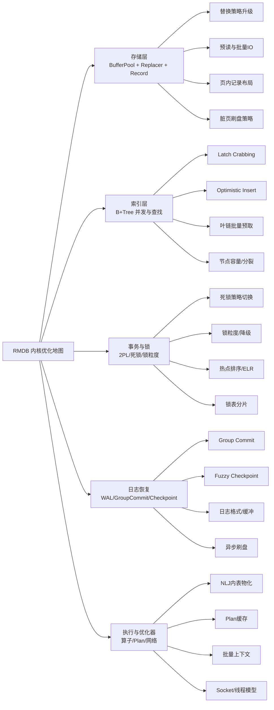
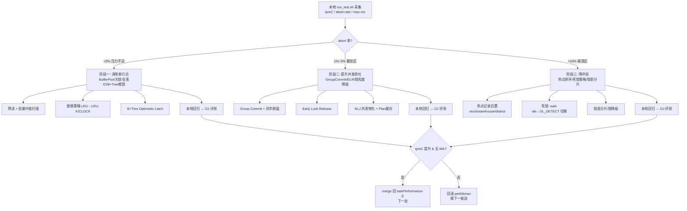

# RMDB 数据库内核优化可选方案参考报告

> 本报告围绕 RMDB 框架在 TPC-C 负载下从基线 tpmC≈1000 出发，**按模块梳理所有可供评测的优化手段**，不预设"最优解"，而是为每个优化点列出可选方案、预期收益、风险、对其他模块的耦合影响与回滚成本，供 `perf/dorian` 分支逐点验证。所有结论以源码事实为准，本报告仅作线索。

当前基线下 tpmC≈1000 通常意味着系统远未跑满硬件——要么处于"压力不足区"（锁/IO 未成为瓶颈），要么某单一模块（如 buffer pool 大锁、B+Tree 全程根锁、提交同步刷盘）成为串行点。**第一阶段突破口往往在"低风险×高收益"的存储与索引并发层，第二阶段才是事务与日志层。** 以下优化地图与决策路线图先给出全局视图，再按模块逐点展开。

---

## 一、总体优化路线图（按 abort 率/tpmC 状态决策）

下面的流程图把项目给的"压力不足区 / 最佳性能区 / 性能崩溃区"三态映射到优化动作链上，**单次只改一处**，按 `低风险×高收益 > 高风险×高收益 > 低风险×低收益` 排序。

---

## 二、存储层（BufferPool + Replacer + Record）

### 2.1 可选优化手段一览

| 优化点 | 当前实现假设 | 可选方案 | 预期收益 | 风险 | 对其他模块影响 | 回滚成本 |
|---|---|---|---|---|---|---|
| 替换策略 | LRU（list+mutex）【turn2search0】 | LRU-K / CLOCK-Sweep / 分区 LRU / 采样式【turn0search23】【turn0search25】 | 缓存命中率↑，扫描污染↓ | 元数据内存↑ | 影响所有 FetchPage 路径，需保证 pin/unpin 语义不变 | 低（独立类） |
| BufferPool 大锁 | 单一 latch_ 保护 page_table_ | 分区 BufferPool（多 instance 按 page_id 哈希）【turn2search7】 | 高并发下 latch 争用↓ | 跨分区操作复杂度↑ | 影响事务/索引访问页路径 | 中 |
| 预读 | 按需单页读 | 顺序检测预读 / 叶链批量预读【turn2search31】 | IO 次数↓，TPC-C 范围扫描受益 | 预读浪费内存 | 与 replacer 联动（预读页置 evictable） | 低 |
| 脏页刷盘 | FlushPage 同步写 | 后台刷脏线程 + WriteRequestQueue + 线程池【turn2search5】 | 提交路径不再阻塞于写盘 | WAL 顺序需保证 | 与 recovery 的 pageLSN/flushedLSN 强耦合 | 中-高 |
| 页大小 | 默认 4KB | 8KB/16KB（需评估编译期常量）【turn1search23】 | 单页承载记录数↑，B+Tree 扇出↑ | 大页内存压力↑ | record/index/recovery 页格式全部联动 | 高 |
| 页内记录布局 | Slotted Page【turn2search29】【turn2search33】 | 删除碎片整理时机调优 / slot array 增长方向 | 页内空间利用率↑ | 整理时需页级写锁 | 影响 record manager 与 index 读写 | 低-中 |

### 2.2 替换策略升级要点

- **LRU 的核心问题**：一次全表扫描会把热数据挤出（sequential flooding），TPC-C 的 `customer by last name`、`stock by item` 这类索引扫描尤其容易污染缓存【turn0search25】。
- **LRU-K（K=2 推荐）**：维护最近 K 次访问时间戳，访问未达 K 次的页优先淘汰。RMDB 的 Rucbase 基线 LRUReplacer 接口为 `Victim/Pin/Unpin/Size`，可直接替换为 LRU-K 实现，接口不变【turn2search0】【turn0search24】。
- **CLOCK-Sweep**：reference bit + 计数权重，PG 即用此方案，锁开销低于 LRU 链表【turn0search23】。
- **分区 LRU**：把 buffer pool 按帧分片，每片独立锁，缓解高并发下中心 latch 争用，代价是命中率略降【turn0search23】。
- **触发条件**：perf 显示 buffer hit rate 偏低且 latch 争用明显时优先尝试 LRU-K；若 latch 争用是主瓶颈则优先分区。

### 2.3 异步刷脏与 WriteRequestQueue

CMU15-445 实验中验证过的做法：FlushPage 不直接同步写盘，而是把写请求丢入 `WriteRequestQueue`，由独立 `DiskScheduler` 线程池消费；调用方通过 future 等待完成【turn2search5】。**关键约束**：WAL 必须先于对应脏页落盘（pageLSN ≤ flushedLSN），否则崩溃恢复会漏 redo。回滚成本中等，需同时改 recovery 的刷盘等待点。

### 2.4 页大小与记录布局

- InnoDB/PolarDB 实测在 TPC-C 中将 `innodb_page_size` 从 4K 调到 8K/16K 可显著提升 B+Tree 扇出与单页记录密度【turn1search23】。RMDB 若页大小是编译期常量，需评估 record/index/recovery 全链路。
- Slotted Page 是行存主流布局，slot array 与 tuple 相向生长【turn2search29】【turn2search33】。可调优点：删除空洞回收时机（提交时 vs eviction 时）、变长记录原地更新 vs 追加迁移。

---

## 三、索引层（B+Tree）

### 3.1 可选优化手段一览

| 优化点 | 当前实现假设 | 可选方案 | 预期收益 | 风险 | 对其他模块影响 | 回滚成本 |
|---|---|---|---|---|---|---|
| Latch 协议 | Basic Crabbing（写时根节点全程写锁）【turn1search41】【turn1search49】 | Optimistic Latch Coupling【turn1search47】【turn0search37】 | 根节点写锁争用↓，插入并发↑ | SMO 时需重走悲观路径，逻辑复杂 | 影响所有索引写路径，与事务原子性联动 | 中 |
| 叶子扫描 | 单页逐次 FetchPage | 叶链批量预取 + 顺序 IO【turn0search35】 | 范围查询 IO↓ | 预读与 latch 释放顺序需协调 | 与 buffer pool 预读联动 | 低 |
| 节点容量 | 固定 max_size | 自适应填充因子 / bulk-load 100% 填充【turn0search31】 | 树高↓，扫描页数↓ | 分裂频率↑ 可能抵消收益 | 影响 SMO 频率与锁持有时间 | 低 |
| 内部查找 | 线性/二分 | SIMD 二分 / 分段索引 | 节点内查找↑ | 实现复杂度↑ | 局限于节点内 | 低 |
| 乐观插入 | 无 | 先读锁到叶→判定安全→升级写锁，否则重试【turn1search47】 | 多写并发↑ | 重试风暴需退避 | 与死锁检测（叶链扫描方向）联动 | 中 |
| 唯一性校验 | 全程持锁 | 仅叶节点校验 + 悲观路径回退 | 插入吞吐↑ | 校验窗口需保证 | 与事务隔离级别联动 | 中 |

### 3.2 Optimistic Latch Coupling 要点

悲观 Crabbing 在插入/删除时对根节点加写锁，会串行化所有写事务；Optimistic 方案先用**读锁**遍历到叶子，仅在叶子加写锁，若发现叶子不安全（会触发分裂/合并）才释放所有锁、自顶向下以写锁重做【turn1search47】【turn1search49】。PolarDB 的 PolarIndex 同样采用"乐观遍历 + SMO 时退化为根 X latch"的策略【turn0search37】。

**触发条件**：perf 显示 B+Tree 根/上层节点 latch 争用高、且 SMO 频率不高时收益最大。

**WA 预防**：SMO 路径必须保证父节点指针更新与子节点分裂的原子可见性，否则并发读会读到半分裂页；同时叶链 `next_page` 指针更新必须与分裂写入顺序满足 WAL。

### 3.3 叶链批量扫描

TPC-C 中 `NewOrder` 按 `o_id` 范围、`Customer by last name` 按索引范围扫描，叶子节点经 `next_page` 串联是 B+Tree 范围查询高效的核心【turn0search35】【turn0search39】。可在迭代器层做批量预取：检测到顺序访问模式后，提前把后续 N 个叶页拉入 buffer pool，减少随机 IO 与逐次 latch 开销。需注意叶链方向扫描与 crabbing 反向扫描的死锁问题，常用做法是"加锁失败即放弃本次扫描重来"【turn1search43】。

### 3.4 节点容量与分裂

- 插入时若分裂频繁，可适当增大 `max_size`（受页大小约束）；bulk-load 阶段（load_data）可一次性 100% 填充叶子以降低树高【turn0search31】。
- 分裂点选择：从中间分裂 vs 从最右分裂，对单调递增键（如 `o_id` 自增主键）后者能减少页分裂频率，但易导致左偏树。

---

## 四、事务与锁管理（Transaction + Lock）

### 4.1 可选优化手段一览

| 优化点 | 当前实现假设 | 可选方案 | 预期收益 | 风险 | 对其他模块影响 | 回滚成本 |
|---|---|---|---|---|---|---|
| 死锁处理 | DL_DETECT / NO_WAIT / WAIT_DIE 之一 | 三者可切换；TPC-C 高冲突下 NO_WAIT 扩展性最佳【turn0search41】【turn0search43】 | 高并发吞吐↑ | abort 率↑ 可能触发雪崩 | 影响所有写事务路径 | 低（策略切换） |
| 锁粒度 | 行级 / 表级 | 行级 + 意向锁；锁降级（X→S） | 冲突↓，吞吐↑ | 锁表膨胀 | 影响 lock manager 内存 | 中 |
| 锁表结构 | 单一全局 hash + latch | 分片锁表 / per-table lock bucket | latch 争用↓ | 跨表事务需协调 | 影响所有 lock/unlock | 中 |
| 热点顺序 | 事务内任意顺序加锁 | 热点记录后置（stock/warehouse/district 最后写）【turn2search17】 | 锁持有时间↓，吞吐↑↑ | 需重排执行算子顺序 | 与执行器 plan 联动 | 中 |
| Early Lock Release | 提交后刷盘再放锁 | 日志写入 log buffer 即放锁，刷盘异步【turn2search21】【turn2search23】 | 串行点↓，吞吐↑ | WAL 持久化窗口扩大，崩溃可能丢已释放锁的提交 | 与 recovery 强耦合 | 高 |
| 时间戳分配 | 全局原子计数 | 批量分配 / 分片时钟【turn0search41】 | T/O 类算法瓶颈↓ | 仅对 OCC/MVCC/MV2PL 有意义 | 影响事务管理器 | 中 |
| 隔离级别 | RR | RR 下加 MVCC 快照读（只读事务无锁）【turn0search41】 | 读不阻塞写，NewOrder 与 Payment 并发↑ | 实现复杂，需版本链 | 与 record/recovery 联动（undo 链） | 高 |

### 4.2 死锁策略选择

Wu et al. 的评测是 TPC-C 并发控制选型的权威参考【turn0search41】【turn0search43】：

- **DL_DETECT**：低冲突下可扩展，高冲突下 lock thrashing 严重，扩展性最差。
- **NO_WAIT**：高冲突下扩展性最好，但 abort 率高，多核回滚成本不可忽视。
- **WAIT_DIE / WOUND-WAIT**：基于时间戳的预防，等待单向无死锁【turn1search31】【turn1search35】。WOUND-WAIT 通常比 WAIT-DIE 回滚更少。
- **OCC / MVCC**：读多写少场景占优，TPC-C 中 Payment 更新 W_YTD 单字段时 MVCC/T-O 因写不阻塞读而显著优于 2PL【turn0search41】。

**建议**：以 `NO_WAIT` 为基准切换候选，本地用 `run_test.sh` 在不同并发档位下测 abort 率与 tpmC；若 abort>10% 雪崩则回退 `WAIT_DIE`。切换成本极低（策略枚举），回滚只需改配置。

### 4.3 热点记录后置（2PL 关键优化）

TPC-C 热点集中在三处：`warehouse.W_YTD`（Payment 更新）、`district.D_NEXT_O_ID`（NewOrder 自增）、`stock.S_QUANTITY`（NewOrder 更新）。2PL 下这些写锁持有到事务结束，若在事务**开头**就加锁，整段事务期间都阻塞其他事务；若把热点写**推到事务最后**再执行，锁持有时间从"整事务"压缩到"提交前最后一瞬"，理论吞吐可提升数倍【turn2search17】。

**实现路径**：执行器在 NewOrder/Payment 的算子树中，把对 warehouse/district/stock 的更新算子尽量靠近 commit 点；或在 plan 阶段重排。

**WA 预防**：重排必须保证语义等价（district 计数器自增必须在 order-line 写入之前完成，否则 O_ID 重复）；abort 事务的热点更新必须完全回滚，不得残留 partial write。

### 4.4 Early Lock Release（ELR）

ELR 在事务日志写入 log buffer（尚未刷盘）时就释放锁，让后续事务提前进入临界区，缩短串行点【turn2search21】【turn2search23】。**前提**：必须保证日志先于"放锁后可能读到的脏数据"持久化，否则崩溃时已提交事务的修改丢失——这要求 recovery 支持正确的 redo 重放且放锁页不会被错误 evict。

**风险等级高**，建议放在阶段二后期，且必须有完整的崩溃恢复测试。

### 4.5 锁表分片

TPC-C 事务访问的表固定，可按 `table_id` 或 `record_id hash` 分片锁表，每片独立 latch，缓解全局锁表 latch 争用【turn0search23】。注意跨分片事务（NewOrder 涉及 warehouse/district/customer/order/stock/item 多表）的加锁顺序仍需统一，否则引入新死锁。

---

## 五、日志恢复（Recovery）

### 5.1 可选优化手段一览

| 优化点 | 当前实现假设 | 可选方案 | 预期收益 | 风险 | 对其他模块影响 | 回滚成本 |
|---|---|---|---|---|---|---|
| 提交刷盘 | 每事务 fsync | Group Commit（满/超时批量刷）【turn1search1】【turn2search19】 | fsync 次数↓↓，吞吐↑↑ | 崩溃窗口内一组事务同生共死 | 与事务提交路径耦合 | 中 |
| 刷盘方式 | fsync | fdatasync（日志文件预分配固定长度时可用）【turn2search23】 | 元数据写开销↓ | 文件长度变化时不可用 | 局限于日志文件 | 低 |
| 检查点 | 静止型 checkpoint | Fuzzy Checkpoint（不停事务，记 ATT+DPT）【turn1search1】【turn1search9】 | 恢复时间↓，运行期停顿↓ | 实现复杂 | 与 buffer pool 脏页表联动 | 中-高 |
| 日志格式 | 物理/逻辑 | Physiological Log（Page+Slot，页内逻辑）【turn1search1】 | 日志体积↓，redo 并发可行 | undo 需对应逻辑 | 影响 record 与 index 更新日志 | 高 |
| 日志缓冲 | 单 buffer | 双 buffer 交替 / 环形 buffer | 写日志不阻塞刷盘 | 内存翻倍 | 局限于 recovery | 低 |
| 异步提交 | 同步 | 异步提交（synchronous_commit=off 等价）【turn2search25】 | 提交延迟↓↓ | 崩溃丢已提交事务（破坏持久性） | 与 ELR 联动 | 高（破坏 ACID，慎用） |

### 5.2 Group Commit 要点

Group Commit 是日志子系统最经典的优化：日志缓冲区满或超时（如 5ms）时一次性刷盘，把多个事务的 fsync 合并为一次【turn1search1】【turn2search19】。**TPC-C 是短事务密集型，Group Commit 通常是阶段二最高收益项之一**。

实现要点：
- 提交线程先写 log buffer，加入"待刷盘队列"后阻塞等待。
- 独立刷盘线程定期（或队列达阈值）取出一批，单次 fsync，然后唤醒所有等待者。
- **WAL 约束**：脏页刷盘前其 pageLSN 对应的日志必须已 flushedLSN，否则崩溃恢复漏 redo【turn1search1】。

**风险**：批内任一日务崩溃相关数据丢失需整批回滚；与 ELR 组合时需额外保证放锁时机在"日志入 buffer"之后、"刷盘"之前。

### 5.3 Fuzzy Checkpoint

静止型 checkpoint 需停所有事务、刷所有脏页，运行期停顿明显【turn1search1】。Fuzzy Checkpoint 把检查点变成时间段：`CHECKPOINT-BEGIN` 记录位点，事务继续运行，`CHECKPOINT-END` 记录此时的 ATT（活动事务表）与 DPT（脏页表）【turn1search1】【turn1search9】。恢复时从 BEGIN 位点分析，修正 ATT/DPT，再做 redo/undo。

**收益**：运行期无明显停顿，恢复时间从全量变为增量。**风险**：实现复杂度高，ATT/DPT 一致性是 WA 高发区，建议放在阶段二后期。

### 5.4 日志格式与双 buffer

- Physiological Log（页内逻辑）兼顾日志体积与 redo 可并发性，是工业界主流【turn1search1】。切换成本高，需重构所有更新操作的日志记录。
- 双 buffer：写线程写 buffer A 时，刷盘线程刷 buffer B，交替使用，避免写日志阻塞刷盘。回滚成本低，收益取决于日志吞吐是否已是瓶颈。

---

## 六、执行与优化器（Execution + Optimizer + Parser）

### 6.1 可选优化手段一览

| 优化点 | 当前实现假设 | 可选方案 | 预期收益 | 风险 | 对其他模块影响 | 回滚成本 |
|---|---|---|---|---|---|---|
| NLJ 内表 | 每行重新执行内表算子 | 内表物化（Materialize 一次）【turn1search15】 | 内表重复扫描↓ | 内存占用↑ | 与 buffer pool 联动 | 低 |
| 内表索引查找 | 全表扫 | 内表走索引 point lookup【turn1search11】【turn1search17】 | NLJ 代价从 O(N·M)→O(N·logM) | 需正确索引 | 依赖索引层 | 低 |
| Plan 缓存 | 每次重新 plan | 相同 SQL 模板复用 plan | parser/optimizer 开销↓ | 参数化语义需等价 | 与 analyze 联动 | 低 |
| 批量执行 | 一次一元组（Volcano） | 向量化批量（一次一批）【turn2search37】【turn2search43】 | 函数调用开销↓，cache 友好 | OLTP 短事务收益有限 | 重写算子接口 | 高 |
| 网络模型 | 每连接一线程 | 线程池 / reactor【turn0search16】【turn1search20】 | 高连接数下内存与调度开销↓ | 连接管理复杂 | 与 socket 层联动 | 中 |
| 算子融合 | 独立算子 | Filter+Scan 融合 / IndexScan+Filter 融合 | 中间结果↓ | 实现复杂度↑ | 局限于执行器 | 中 |
| 谓词下推 | 无 | WHERE 下推到 IndexScan | IO↓ | 需正确 plan | 与 optimizer 联动 | 中 |

### 6.2 NLJ 内表物化与索引查找

TPC-C 中大量 join 是 PK→FK 等值连接（如 `order_line.ol_o_id = orders.o_id`）， Nested Loop Join 若内表无索引则每行外表都要全表扫，代价 O(N·M)【turn1search11】【turn1search15】。两项独立可叠加的优化：

- **内表物化**：内表算子只执行一次，结果缓存到内存，后续外表每行在内存中查找【turn1search15】。适合内表较小（如 item 表）。
- **内表索引 point lookup**：内表走 B+Tree 索引，每次 O(logM) 定位【turn1search17】。适合内表大且 join 列有索引。

**触发条件**：perf 显示某算子 CPU 占比高且为 NLJ 时优先尝试；TPC-C 的 item、customer by last name 是典型受益点。

### 6.3 Plan 缓存

TPC-C 五类事务的 SQL 模板高度固定（仅参数不同），每次重新 parser+analyze+optimize 是纯浪费。Plan 缓存按 SQL 模板哈希复用 plan，参数化执行。**注意**：参数化必须保证语义等价（特别是涉及 district/o_id 自增、stock 更新等带副作用的语句），否则 WA。

### 6.4 向量化执行

向量化把 Volcano 的"一次一元组"改为"一次一批列存向量"，减少虚函数调用、提升 cache 命中与 SIMD 友好【turn2search37】【turn2search43】。但 TPC-C 是**短事务 OLTP**，单事务行数少，向量化收益有限（OceanBase/CockroachDB 主要在 AP 负载受益）【turn2search39】。**优先级低**，建议放在阶段三或仅对扫描密集算子局部应用。

### 6.5 网络与线程模型

TPC-C 评测工具（如 BenchmarkSQL）会开大量连接，"每连接一线程"模型下线程数膨胀会导致栈内存与调度开销压垮系统【turn0search16】。线程池模型可固定 worker 数，连接只负责收发 SQL。PolarDB TPC-C 优化中 buffer pool instances 与线程池是常见配置项【turn1search23】。

---

## 七、优化验证闭环与避坑清单

### 7.1 验证流程（严格遵守"一次只改一处"）

1. **本地先跑通**：`run_test.sh`（单测 + 集成 + 压测），观察 tpmC / abort-rate / max-rss-gb。
2. **形成假设**：基于 perf 与源码理解，定位单一瓶颈点。
3. **改一处**：在 `perf/dorian` 分支上只改一个模块的一个方面。
4. **本地回归**：单测 + 集成 + 压测全部通过，且 tpmC 不退化。
5. **OJ 评测**：节制提交，确认在线 tpmC 提升且无 WA。
6. **决策**：通过则 merge 回 `taskPerformance-β`；不通过则回滚 `perf/dorian`，换下一候选。

### 7.2 Perf 分区参考（来自项目约束）

| abort 率 | tpmC 表现 | 优化动作 |
|---|---|---|
| ≈0% | 随并发线性上升 | 压力不足，先消除串行点（buffer pool 大锁、B+Tree 根锁、同步刷盘） |
| 1%~5% | 峰值 | 最佳区，做并发吞吐提升（GroupCommit/ELR/锁粒度） |
| >10%~20% | 急剧下降 | 性能崩溃，降冲突优先（热点排序/死锁策略/锁分片） |

### 7.3 WA 预防清单（性能越高越要警惕）

以下路径是历史 WA 高发区，任何性能改动前必须主动预演：

- **事务原子性**：abort 事务的 partial writes 必须完全回滚，尤其在 ELR/异步刷盘下。
- **district/order 计数器**：`D_NEXT_O_ID` 自增必须与 order 写入原子绑定，热点后置重排时不得破坏顺序。
- **stock 更新**：`S_QUANTITY` 更新与 `S_DIST_xx` 读取必须在同一事务内，乐观并发下需校验。
- **buffer eviction 一致性**：evict 脏页前其日志必须已 flushedLSN（WAL），evict 与 pin 之间不得有窗口。
- **索引维护**：B+Tree SMO 期间父指针与叶链 `next_page` 的更新顺序必须满足 WAL 与原子可见性。
- **Group Commit 批次**：批内任一日务失败不得污染同批其他日务的提交状态。
- **检查点 ATT/DPT**：Fuzzy Checkpoint 的活动事务表与脏页表必须能被恢复阶段正确修正。

### 7.4 优先级建议（稳健优先）

按"低风险×高收益 > 高风险×高收益 > 低风险×低收益"排序，建议的尝试顺序：

1. **替换策略 LRU→LRU-K**（低风险×中收益，独立模块）
2. **B+Tree Optimistic Latch**（中风险×高收益，根锁争用大时）
3. **NLJ 内表物化 + 索引查找**（低风险×中-高收益，TPC-C 大量 PK-FK join）
4. **Plan 缓存**（低风险×中收益，SQL 模板固定）
5. **死锁策略切换 NO_WAIT/WAIT_DIE**（低风险×中收益，按 abort 区切换）
6. **热点记录后置**（中风险×高收益，2PL 关键优化）
7. **Group Commit + 双 buffer**（中风险×高收益，阶段二核心）
8. **异步刷脏 + 后台刷盘线程**（中-高风险×高收益）
9. **Fuzzy Checkpoint**（中-高风险×中收益，恢复时间↓）
10. **ELR**（高风险×高收益，最后尝试，需完整崩溃测试）
11. **向量化 / 锁表分片 / 分区 BufferPool**（高复杂度×边际收益，最后考虑）

---

## 附录：跨模块耦合矩阵（改动影响速查）

| 改动模块 | buffer pool | index | transaction | recovery | execution | record |
|---|---|---|---|---|---|---|
| 替换策略 | - | 命中率↑ | 无 | 无 | 无 | 无 |
| B+Tree Latch | 命中率↑ | - | SMO 原子性 | WAL 顺序 | 索引扫描路径 | 无 |
| 死锁策略 | 无 | 无 | - | abort 回滚 | 无 | 无 |
| Group Commit | 脏页刷盘等待 | 无 | 提交路径 | - | 无 | 无 |
| ELR | evict 约束 | 无 | 放锁时机 | 强耦合 | 无 | 无 |
| 热点后置 | 无 | 无 | 锁持有时间 | 无 | plan 重排 | 无 |
| NLJ 物化 | 内存↑ | 内表走索引 | 无 | 无 | - | 无 |
| 页大小 | 全链路 | 扇出↑ | 无 | 页格式 | 无 | 布局变 |

> 改动任一模块前，对照本矩阵评估相邻模块的回归测试覆盖度，避免单点优化引入跨模块 WA。
