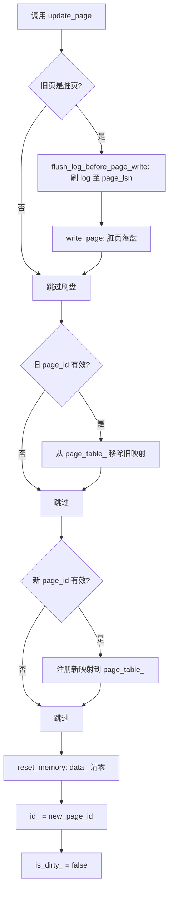

# 02 帧替换流程：update_page 与 flush_log_before_page_write

本文档讲解 BufferPoolManager 中帧（frame）被替换为新页时的完整流程，覆盖 `update_page` 和 `flush_log_before_page_write` 两个函数。

## 前置知识

- **帧（frame）**：buffer pool 中一块固定大小的内存，对应 `pages_[i]`，可承载任意一个 Page
- **page_table_**：`unordered_map<PageId, frame_id_t>`，从逻辑页 ID 映射到帧号
- **pin_count**：Page 被多少上层模块引用。>0 表示正在被使用，不可淘汰
- **LSN（Log Sequence Number）**：日志序列号，单调递增。每个 Page 记录自己的 page_lsn，表示「最后修改本页的那条日志的编号」

## 触发时机

当 buffer pool 需要为一个新 page_id 分配帧、但 free_list_ 已空时，必须从 replacer 淘汰一个旧页腾出帧。`update_page` 就是这个「腾出帧并切换身份」的操作。

两个调用方：

```
fetch_page:  帧承载从磁盘读入的已有页
new_page:    帧承载全新分配的空白页
```

## 整体流程



## flush_log_before_page_write — WAL 协议

```cpp
void BufferPoolManager::flush_log_before_page_write(Page *page) {
    if (log_manager_ == nullptr) return;
    lsn_t page_lsn = page->get_page_lsn();
    if (page_lsn == INVALID_LSN) return;
    log_manager_->flush_up_to(page_lsn);
}
```

**作用**：将 LSN ≤ page_lsn 的所有日志记录刷到稳定存储。

**为什么脏页落盘前必须刷 log**：这是 WAL（Write-Ahead Logging）的核心规则。假设反过来——先写页再刷 log，崩溃发生在两者之间：

```
时间线：  写脏页到磁盘 ✓  →  刷 log ✗  →  崩溃
结果：   磁盘上的页已包含修改，但 log 中没有对应记录
         崩溃恢复时无法重放，数据不一致
```

正确的顺序（WAL）：

```
时间线：  刷 log ✓  →  写脏页到磁盘 ✓  →  安全
结果：   即使崩溃在写页之后，log 中有完整记录，恢复时重放即可
```

**INVALID_LSN 的含义**：page_lsn 为 INVALID_LSN 表示该页自创建后从未被修改过（new_page 刚分配时设置为此值），没有与之关联的日志记录，无需刷盘。

## update_page — 帧身份切换

```cpp
void BufferPoolManager::update_page(Page *page, PageId new_page_id,
                                     frame_id_t new_frame_id) {
    // 1. 旧页是脏页 → 先刷 log 再落盘
    if (page->is_dirty()) {
        flush_log_before_page_write(page);
        disk_manager_->write_page(page->get_page_id().fd,
                                   page->get_page_id().page_no,
                                   page->get_data(), PAGE_SIZE);
        page->is_dirty_ = false;
    }

    // 2. 旧身份从哈希表注销
    if (page->get_page_id().page_no != INVALID_PAGE_ID) {
        page_table_.erase(page->get_page_id());
    }

    // 3. 新身份注册到哈希表
    if (new_page_id.page_no != INVALID_PAGE_ID) {
        page_table_.emplace(new_page_id, new_frame_id);
    }

    // 4. 清空数据区，换身份证
    page->reset_memory();
    page->id_ = new_page_id;
    page->is_dirty_ = false;
}
```

### 关键理解：update_page 不加载数据

`update_page` 只做身份切换，**不为新页同步任何数据**。调用结束时 `data_` 全为零。数据的来源由调用方在 `update_page` **之后**完成：

```
┌──────────────┬──────────────────────────────────┐
│ 调用方        │ update_page 之后                  │
├──────────────┼──────────────────────────────────┤
│ fetch_page   │ disk_manager_->read_page() 从磁盘 │
│              │ 读入数据，覆盖全零的 data_         │
├──────────────┼──────────────────────────────────┤
│ new_page     │ 不读盘。页保持全零，由上层逐步     │
│              │ 写入数据（如插入记录）             │
└──────────────┴──────────────────────────────────┘
```

### 为什么需要 reset_memory()

对 `new_page` 是必需的——全新页应从全零开始，没有 read_page 来填充，不 reset 就会残留旧页数据。

对 `fetch_page` 看似多余（后续 read_page 会覆盖整个 data_），但保留 reset 有两层意义：一是防御性——确保即使调用方忘记 read_page 也不会泄漏旧数据；二是语义清晰——帧身份已切换，旧数据不应该再可见。

## 总结

| 函数 | 职责 |
|------|------|
| `flush_log_before_page_write` | 保证 WAL 协议：脏页落盘前，对应日志已持久化 |
| `update_page` | 帧身份切换：刷旧 → 注销旧映射 → 注册新映射 → 清零 → 换 ID |

`update_page` 之后，帧的数据区为全零。`fetch_page` 立即用 `read_page` 填充，`new_page` 保持全零等待上层写入。
