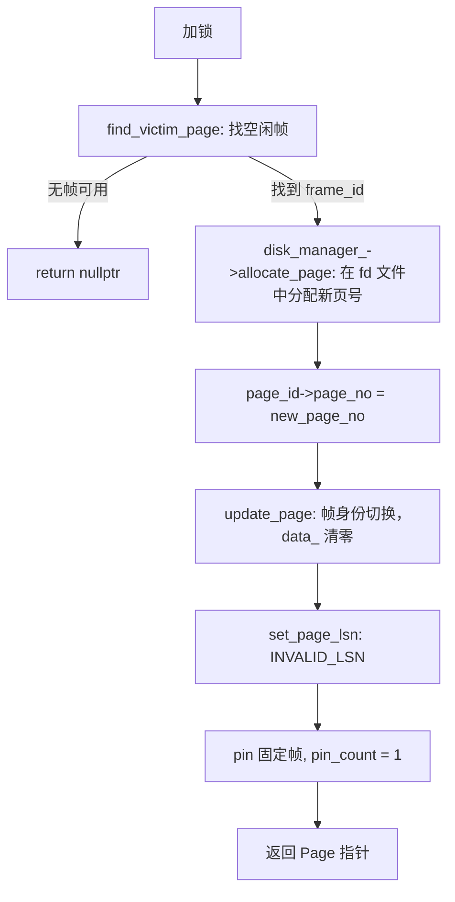

# 04 new_page：创建新页

本文档讲解 `new_page` 的完整流程和 `page_id` 参数的 in/out 语义。

## page_id 的 in/out 语义

```cpp
Page *BufferPoolManager::new_page(PageId *page_id);
```

`page_id` 既是输入也是输出：

| 字段 | 方向 | 含义 |
|------|------|------|
| `page_id->fd` | **输入** | 在哪个文件（file descriptor）中分配新页。调用方必须预先设置 |
| `page_id->page_no` | **输出** | 分配到的页号（page number），由 `new_page` 填入 |

调用前 `page_no` 通常设为 `INVALID_PAGE_ID`，函数返回后被替换为真实页号。

## 典型调用

```cpp
// ix_index_handle.cpp
PageId new_page_id = {.fd = fd_, .page_no = INVALID_PAGE_ID};
Page *page = buffer_pool_manager_->new_page(&new_page_id);
// new_page_id.page_no 已被填入分配到的页号

// unit_test.cpp
PageId page_id_temp = {.fd = fd, .page_no = INVALID_PAGE_ID};
auto *page0 = bpm->new_page(&page_id_temp);
```

## 内部流程



## 与 fetch_page 的对比

| | new_page | fetch_page |
|------|----------|------------|
| 页的来源 | 磁盘上全新分配 | 磁盘上已有页 |
| page_id 参数 | in/out（fd 入，page_no 出） | 纯输入（fd + page_no 都已知） |
| 数据加载 | 不加载，data_ 保持全零 | read_page 从磁盘读入数据 |
| page_lsn | 设为 INVALID_LSN | 保持从磁盘读入的原始值（或被后续修改更新） |
| 使用场景 | 插入新记录时需要新页 | 读取/修改已有记录 |

## 总结

`new_page` 的核心职责：在指定文件（fd）中分配一个新页号，在 buffer pool 中占一个帧，返回一个数据区全零的 Page 指针。新页的数据由上层逐步写入（如插入记录、构建 B+Tree 节点）。
