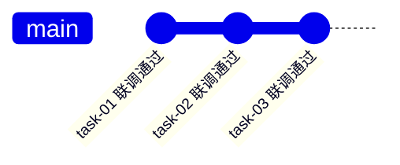
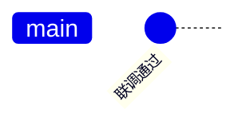

# Mermaid gitGraph 规范

**核心规则：同一张 gitGraph 图内，所有 `commit id` 的值必须唯一，不可重复。重复 id 会导致 Mermaid 渲染失败。**

## 如何避免重复

- 在描述性 id 后加序号或场景前缀区分，如 `"task-01 联调通过"` / `"task-02 联调通过"`
- 不同图之间的 id 可以相同，互不影响
- 连续描述同一类型事件时尤其容易重复（如"联调通过"、"测试通过"），要特别注意

## 正确示例

## 错误示例（会渲染失败）

**How to apply:** 每次编写或修改 mermaid gitGraph 时，确保同一图内所有 commit id 互不相同。写完图后自查一遍。
