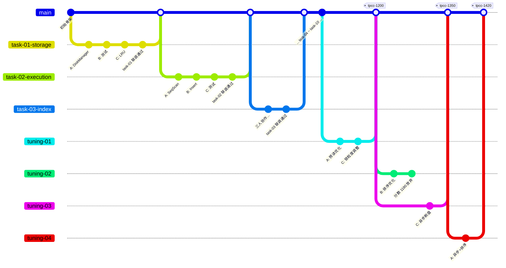
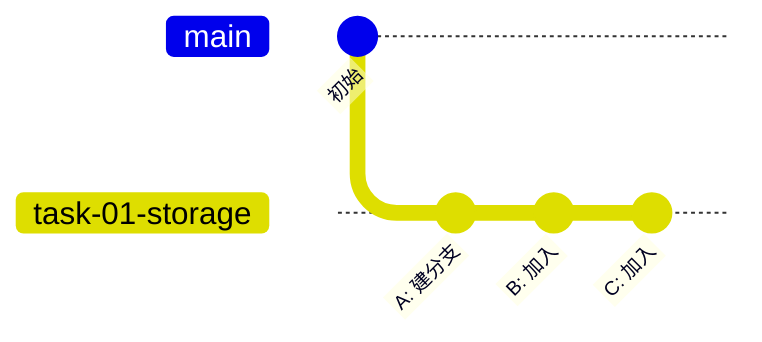
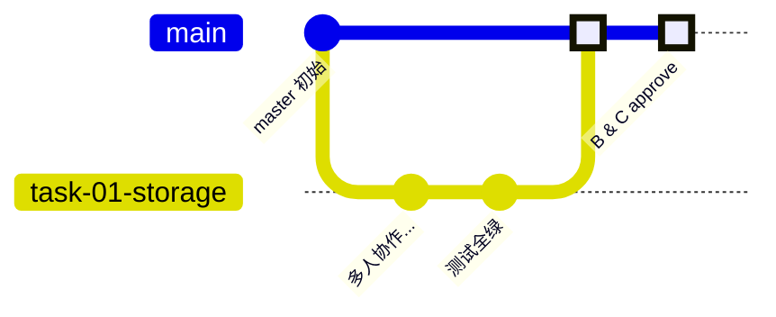
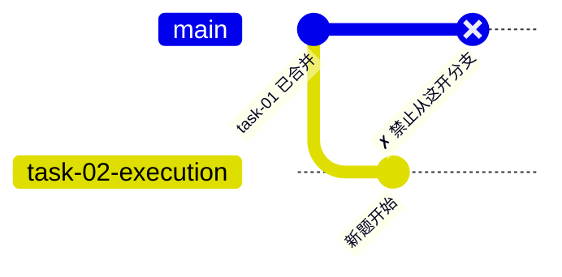
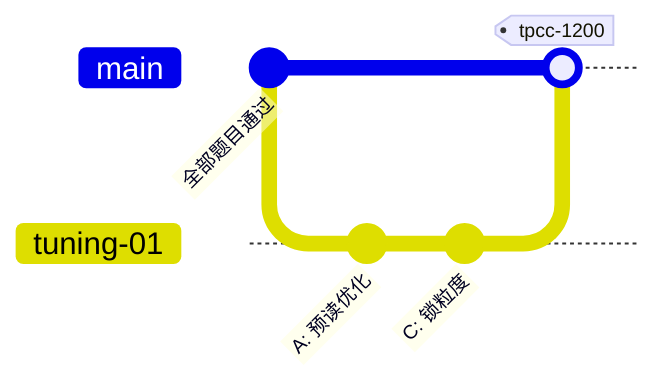
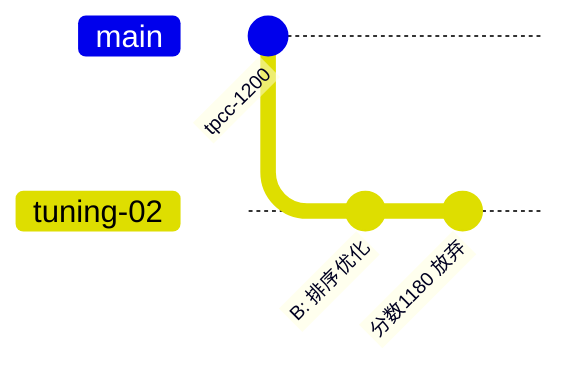
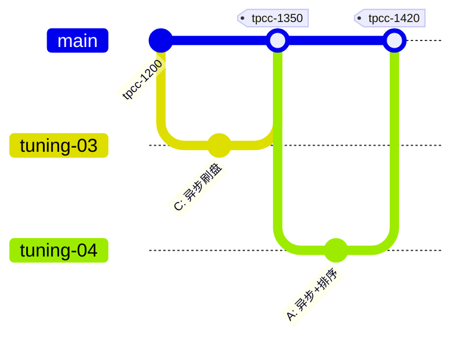
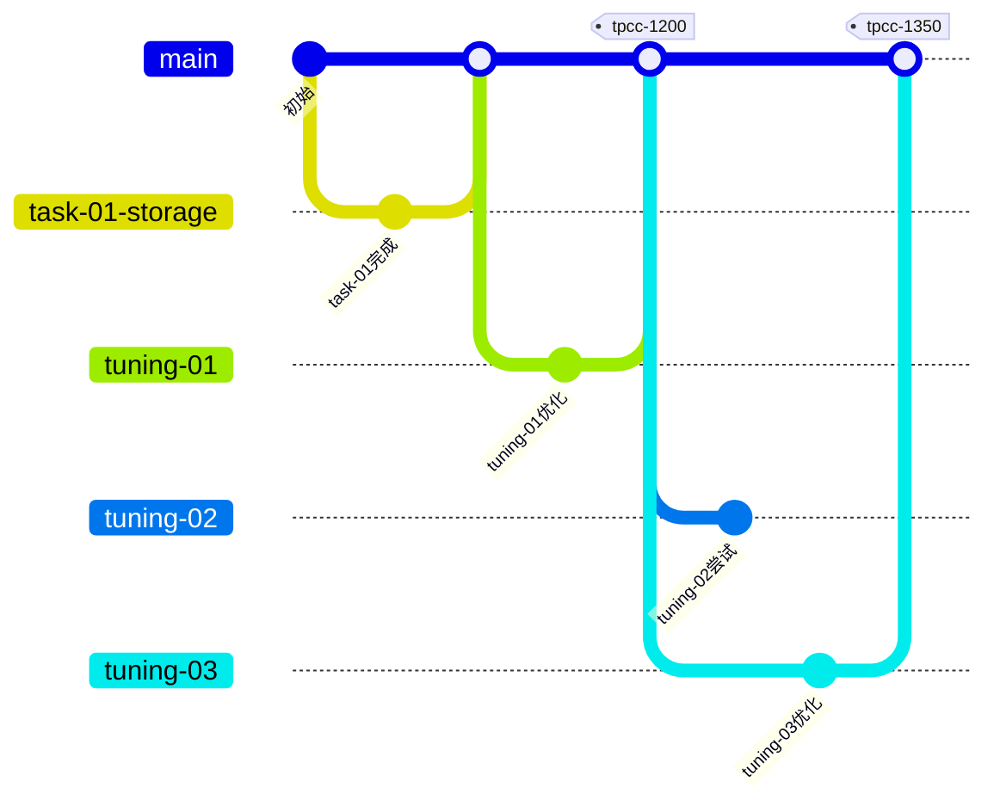
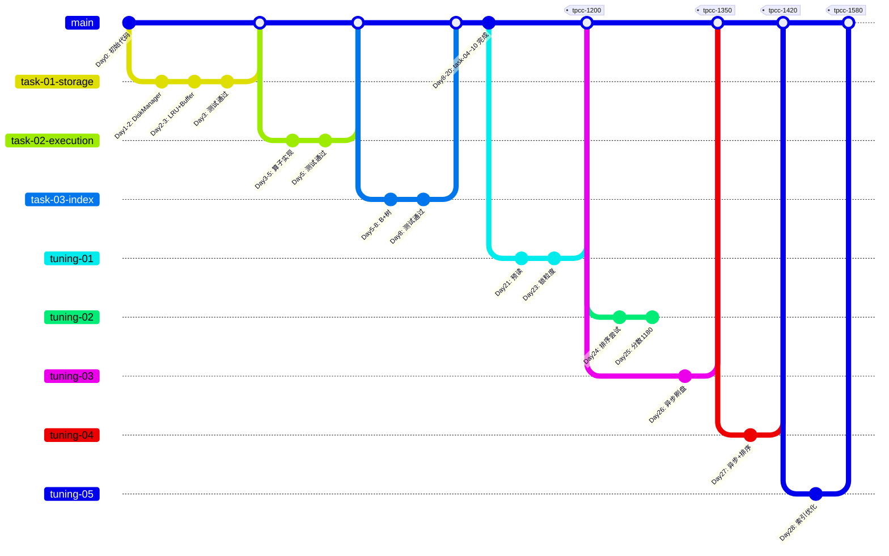

# Git 协作场景模拟

基于 `git-协作规范.md`，模拟三人（A、B、C）从初赛到调优的完整协作过程。

## 全局视图



> 注：`main` 即 master。Mermaid gitGraph 默认主分支名为 main，实际操作中对应 master。

---

## 场景一：开始第一道题（task-01-storage）

**背景：** 仓库刚初始化，master 只有骨架代码和文档。

```
A: 我来建分支。
$ git checkout master
$ git pull origin master
$ git checkout -b task-01-storage
$ git push -u origin task-01-storage

A: 分支建好了，大家拉一下。
```

```
B: 收到。
$ git fetch origin
$ git checkout -b task-01-storage origin/task-01-storage

C: 收到。
$ git fetch origin
$ git checkout -b task-01-storage origin/task-01-storage
```

三人现在都在 `task-01-storage` 上。



**关键点：** 只有一个人建分支并 push，其他人 fetch + checkout 远程分支。

---

## 场景二：正常协作——改不同文件

**背景：** A 写 DiskManager，B 写测试，C 写 LRUReplacer。

```mermaid
gitGraph
   checkout task-01-storage
   commit id: "A: DiskManager 读写"
   commit id: "B: 测试代码"
   commit id: "C: 本地 LRU"
   commit id: "C: rebase后push"
```

```
A: 我写 DiskManager::write_page 和 read_page。
$ vim src/storage/disk_manager.cpp
$ git add src/storage/disk_manager.cpp
$ git commit -m "feat(storage): 实现 DiskManager 页面读写

- write_page: 将内存页面写入磁盘文件指定偏移
- read_page: 从磁盘文件读取页面到内存"

B: 我写 DiskManager 的测试。
$ vim our-test/disk_manager/01-create_file_test.cpp
$ git add our-test/disk_manager/
$ git commit -m "test(storage): 新增 DiskManager 文件创建测试"
```

```
B: 我 push 了。
$ git push

C: 我这边 LRUReplacer 写好了，准备 push。
$ git push
# 报错！远程有新的提交

C: 先拉一下。
$ git pull --rebase origin task-01-storage
$ git push
# 成功
```

**关键点：** push 前自动失败 → `pull --rebase` → 再 push。不强制 push。

---

## 场景三：正常协作——改同一文件

**背景：** A 和 B 都改了 `buffer_pool_manager.cpp`，A 先 push 了。

```mermaid
gitGraph
   checkout task-01-storage
   commit id: "之前的提交"
   branch "B本地(过时)"
   checkout task-01-storage
   commit id: "A: fetch_page"
   checkout "B本地(过时)"
   commit id: "B: new_page"
   checkout task-01-storage
   merge "B本地(过时)"
   commit id: "B: rebase解决冲突" type: HIGHLIGHT
```

```
A: 我的 BufferPoolManager::fetch_page 写好了。
$ git add src/storage/buffer_pool_manager.cpp
$ git commit -m "feat(storage): 实现 BufferPoolManager fetch_page"
$ git push
# 成功

B: 我也改了同一个文件，push 失败。
$ git push
# ! [rejected] task-01-storage -> task-01-storage (non-fast-forward)

B: rebase 一下。
$ git pull --rebase origin task-01-storage
# CONFLICT: src/storage/buffer_pool_manager.cpp
# 冲突了！

B: 看一下冲突在哪。
$ git diff --name-only --diff-filter=U
# src/storage/buffer_pool_manager.cpp

B: 打开文件，找到 <<<<<<< 标记，跟 A 协商一下怎么合并。
# 协商后手动解决冲突，删掉标记

$ git add src/storage/buffer_pool_manager.cpp
$ git rebase --continue
$ git push
# 成功
```

**关键点：** 冲突了不要慌，`git diff` 看冲突文件 → 协商 → 手动解决 → `rebase --continue`。

---

## 场景四：第一道题完成——提 PR 合并

**背景：** task-01-storage 编码完成，测试全绿。



```
A: 我来提 PR。
# 在 GitLab/GitHub 上创建 Merge Request
# 源分支: task-01-storage → 目标分支: master
# 标题: feat(storage): 实现存储管理模块

A: PR 提好了，B 和 C review 一下。
```

```
B: 看了一下代码，没问题，approve。

C: 我也看了，approve。
```

```
A: 两个 approve 都有了，合并！
# 点击 Merge 按钮
# 勾选 "Delete source branch"
```

```
所有人: 同步本地 master。
$ git checkout master
$ git pull origin master
$ git branch -d task-01-storage  # 删除本地分支（可选）
```

**关键点：** PR + 两人 approve 才能合并。合并后所有人同步 master。

---

## 场景五：下一道题——基于新 master

**背景：** task-01 已合入 master，开始 task-02-execution。



```
A: 基于最新的 master 开新分支。
$ git checkout master
$ git pull origin master
$ git checkout -b task-02-execution
$ git push -u origin task-02-execution

B 和 C: 拉新分支。
$ git fetch origin
$ git checkout -b task-02-execution origin/task-02-execution
```

**关键点：** 新分支一定从最新 master 开出，不基于上一题的旧分支。

---

## 场景六：push 前忘记同步

**背景：** B 写代码的时候，C 已经 push 了好几轮。B 写完直接尝试 push。

```mermaid
gitGraph
   checkout task-02-execution
   commit id: "C: push 1"
   commit id: "C: push 2"
   branch "B本地"
   checkout "B本地"
   commit id: "B: 本地提交"
   checkout task-02-execution
   merge "B本地"
   commit id: "B: rebase后push" type: HIGHLIGHT
```

```
B: 写好了，push。
$ git push
# ! [rejected] ... (non-fast-forward)

B: 糟糕，忘了先 pull。
$ git pull --rebase origin task-02-execution
# 自动合并，没有冲突

$ git push
# 成功
```

**关键点：** 养成习惯：push 前先 `pull --rebase`。出错了补救也不晚。

---

## 场景七：commit 混了测试和代码——分开提交

**背景：** B 同时改了一个 .cpp 和一个 test 文件，想一次 commit。

```mermaid
gitGraph
   checkout task-02-execution
   commit id: "之前的提交"
   commit id: "feat(execution): SeqScan" type: HIGHLIGHT
   commit id: "test(execution): SeqScan测试" type: HIGHLIGHT
```

> 上图是正确做法：代码和测试分两次 commit。不要把它们混在一个 commit 里。

```
B: 等等，规范说测试和代码要分开提交。
$ git status
# modified: src/execution/seq_scan_executor.cpp
# modified: our-test/execution/01-seq_scan_test.cpp

# 分开 add
$ git add src/execution/seq_scan_executor.cpp
$ git commit -m "feat(execution): 实现 SeqScanExecutor Next 接口"

$ git add our-test/execution/01-seq_scan_test.cpp
$ git commit -m "test(execution): 新增 SeqScanExecutor 测试"
```

**关键点：** 代码和测试分两次 commit。用 `git add <具体文件>` 控制。

---

## 场景八：所有题目完成——开始调优

**背景：** 10 道题全部合入 master，开始性能调优。



```
A: 我有个预读优化的想法，试试。
$ git checkout master
$ git checkout -b tuning-01
$ git push -u origin tuning-01

# A 做了优化，C 也在这个分支上加了一个锁粒度调整
# 两人在 tuning-01 上协作了几天，push 到远程

A: 提交平台跑一下。
# 平台返回: TPC-C = 1200

A: 比之前的 1000 高！合入 master 打 tag。
$ git checkout master
$ git merge tuning-01
$ git tag -a tpcc-1200 -m "tuning-01: 预读优化 + 锁粒度调整"
$ git push origin master --tags
```

---

## 场景九：调优——B 试了但分数没涨

**背景：** B 有一个排序优化的想法，在 tuning-02 上试了。



> tuning-02 永远不合入 master，作为分支保留。master 继续向前。

```
B: 我从 master 开 tuning-02 试试排序优化。
$ git checkout master
$ git checkout -b tuning-02

# B 写了优化代码，push，提交平台
# 平台返回: TPC-C = 1180  （比 1200 低了！）

B: 分数掉了，这个分支不合入 master，留着当记录。
$ git push -u origin tuning-02

A: 嗯，tuning-02 留着，我们知道排序改内存没效果。
    下次绕过这个方向。
```

**关键点：** 低分分支不合入、不删除，保留作为踩坑记录。

---

## 场景十：调优——C 的优化更好

**背景：** A 在 tuning-03 试了异步刷盘，C 在 tuning-04 将异步+排序组合。



> tuning-02 的排序代码被移植到 tuning-04，与异步刷盘组合后反而有效了。

```
C: 我在 tuning-03 上试了异步刷盘。
# 提交平台: TPC-C = 1350

C: 比 tpcc-1200 高！合入！
$ git checkout master
$ git merge tuning-03
$ git tag -a tpcc-1350 -m "tuning-03: 异步刷盘，1200→1350"
$ git push origin master --tags
```

```
A: tuning-02 的排序优化虽然当时低了，但我想到可以结合 C 的异步刷盘
    再试一次。

A: 从 master（现在有 tpcc-1350 的代码）开 tuning-04
$ git checkout master
$ git checkout -b tuning-04

# 结果: TPC-C = 1420
$ git checkout master
$ git merge tuning-04
$ git tag -a tpcc-1420 -m "tuning-04: 异步刷盘 + 排序优化，1350→1420"
$ git push origin master --tags
```

**关键点：** 好的优化不断叠加到 master，后来者站在前人的肩膀上。

---

## 场景十一：查看历史——我们怎么走到这里的



> 最终 master 上有递增的 tag，分支里保留了成功和失败的完整记录。

```
新人（或回顾时）:
$ git log --oneline master
# 可以看到 master 的完整演进

$ git tag -l 'tpcc-*' --sort=-v:refname
# tpcc-1420
# tpcc-1350
# tpcc-1200

$ git show tpcc-1350
# 查看 tpcc-1350 这个 tag 的详细信息（谁打的、什么优化）

$ git branch -a
# master
# tuning-01  （1200，已合并）
# tuning-02  （1180，失败尝试，未合并）
# tuning-03  （1350，已合并）
# tuning-04  （1420，已合并）
```

**关键点：** `git tag` 一眼看到所有分数里程碑，`git branch` 看到所有尝试记录。

---

# 完整链路模拟

从比赛第一天到提交最终分数的全过程演练。

## 时间线总览



---

## Day 0：准备

三人聚在一起通读了 `git-协作规范.md` 和本文档，确保大家对分支命名、commit 格式、合并规则有一致理解。确认仓库 master 上的初始骨架可以编译。

```
所有人:
$ cd build && cmake .. && make -j$(nproc)
# 编译成功
```

---

## Day 1-3：task-01-storage（存储管理）

**Day 1 上午：** A 从 master 创建 `task-01-storage`，B 和 C fetch 后 checkout。

三人分工：A 写 DiskManager，B 写 LRUReplacer，C 写 BufferPoolManager 同时准备测试。

**Day 1 下午：** A 先完成 `write_page` 和 `read_page`，commit + push。B 写 LRU 的时候 `pull --rebase` 拉到了 A 的代码。C 发现 BufferPoolManager 依赖 LRU，等 B 写完再继续，先帮 A 写 DiskManager 的测试。

```
A: feat(storage): 实现 DiskManager 页面读写
B: feat(lru): 实现 LRU 淘汰策略 victim/pin/unpin
A: feat(storage): 实现 DiskManager 文件创建与销毁
C: test(storage): 新增 DiskManager 完整测试
C: feat(storage): 实现 BufferPoolManager fetch_page
```

**Day 2：** B 和 C 调试 BufferPoolManager + LRU 的联动。A 写 `new_page` 和 `delete_page`。晚上第一次跑完整测试，挂了两个用例——发现 `flush_page` 没有正确更新 `is_dirty_`。三人一起 debug 到凌晨。

**Day 3 上午：** 修复，全部测试通过。A 提 PR，B 和 C review + approve，合并到 master。

```
$ git checkout master && git pull origin master
$ git tag -l  # 还没有 tag，初赛阶段不打 tag
```

---

## Day 3-5：task-02-execution（查询执行）

**Day 3 下午：** 紧接着从新 master 创建 `task-02-execution`。

三人各自认领算子：A 做 SeqScan + IndexScan，B 做 Insert + Update + Delete，C 做 Projection + Sort。测试也是各自写。

**Day 4：** C push SortExecutor 时冲突了——A 改了一个公共头文件。C rebase 解决冲突后 push。

```
C: git push  # rejected
C: git pull --rebase origin task-02-execution
# CONFLICT: src/execution/executor.h
# A 改了 executor 基类的接口，C 的 SortExecutor 用了旧接口
# 两人协商，C 手动调整调用方式
C: git add src/execution/executor.h src/execution/sort_executor.cpp
C: git rebase --continue
C: git push  # OK
```

**Day 5：** 所有算子联调通过。A 提 PR，两人 approve，合并。

---

## Day 5-8：task-03-index（唯一索引）

B+ 树实现量大，三人协商：A 做 IxNodeHandle 层（节点操作），B 做 IxIndexHandle 层（整树操作），C 写测试。

**Day 7：** B 发现 `insert_entry` 的节点分裂有 bug，但 A 在做的 `IxNodeHandle::split` 是底层——调了 A 的代码后 B 的问题解决。体现了聚焦同一分支的好处：随时沟通，随时联调。

**Day 8：** 测试通过，PR 合并。

---

## Day 8-20：task-04 ~ task-10

节奏稳定下来，每道题 1-3 天。中间遇到过的典型问题：

- **task-05 写聚合函数时**，发现 task-02 的 ProjectionExecutor 有个边界 case 没处理。没有回溯修旧分支，直接在 task-05 上修了，因为代码最终都会进 master。
- **task-06 和 task-07 同时涉及 execution/**，两个分支在同一个文件上有重叠修改——靠 rebase 解决，提前沟通谁改了哪些函数。
- **task-09（隔离级别）** 最难，三人轮流主攻，另外两人辅助写测试和 review。

**Day 20：** task-10 合并完成。初赛阶段结束，10 道题全部通过。

```
$ git log --oneline master | wc -l
# 约 80 个 commit，10 个 task 分支，10 次 PR
```

---

## Day 21-23：调优 tuning-01（→ tpcc-1200）

**Day 21：** A 从 master 创建 `tuning-01`，做了 BufferPool 预读优化。push 后提交平台——等了 2 小时返回结果：TPC-C = 1200（基线 1000）。

```
A: feat(storage): 实现 BufferPool 顺序预读，TPC-C 1000→1200
   合入 master，打 tag tpcc-1200
```

**Day 22-23：** C 在同一个 tuning-01 上继续做锁粒度调整，分数微涨到 1250。A 又在此基础上改了页面分配策略，最终 `tuning-01` 稳定在 1200（综合评估后锁定此分数打 tag）。

```
$ git checkout master
$ git merge tuning-01
$ git tag -a tpcc-1200 -m "预读优化 + 锁粒度调整 + 页面分配优化"
$ git push origin master --tags
```

---

## Day 24-25：tuning-02（失败，不合入）

**Day 24：** B 从 master 创建 `tuning-02`，尝试把 Sort 算子改为全内存排序。写了两天，提交平台——1180，比 1200 还低。

```
B: 分析一下：内存排序在数据量小时更快，但 TPC-C 数据量大、
    内存不够，反而触发大量缺页。方向没错但前提不成立。

B: 不合入了，push 上去留着记录。
$ git push -u origin tuning-02

其他人: 好的，tuning-02 留着，我们知道内存排序在 TPC-C 场景下不行。
```

---

## Day 26：tuning-03（→ tpcc-1350）

C 从 master 创建 `tuning-03`，将 DiskManager 的 `write_page` 改为异步写入。提交平台——1350。

```
$ git checkout master
$ git merge tuning-03
$ git tag -a tpcc-1350 -m "异步刷盘，1200→1350"
$ git push origin master --tags
```

---

## Day 27：tuning-04——组合优化（→ tpcc-1420）

A 想到：tuning-02 的排序优化在 tuning-03 的异步刷盘基础上可能有不同表现——磁盘压力减小了，内存排序的缺页问题可能缓解。

从 master（tpcc-1350）开 `tuning-04`，把排序优化移植过来。提交平台——1420。

```
$ git checkout master
$ git merge tuning-04
$ git tag -a tpcc-1420 -m "异步刷盘 + 内存排序，1350→1420"
$ git push origin master --tags
```

**关键洞察：** tuning-02 虽然当时失败了，但它的代码成为了 tuning-04 的基础。失败分支不是废的——后续可以和其他优化组合。

---

## Day 28：tuning-05（→ tpcc-1580）

B 在 B+ 树索引上做了节点压缩优化，从 master（tpcc-1420）开出 `tuning-05`。1580。

---

## 比赛结束

最终仓库状态：

```
$ git branch -a
  master
  task-01-storage      (remote, 已合并)
  task-02-execution    (remote, 已合并)
  ...
  tuning-01            (remote, 已合并)
  tuning-02            (remote, 未合并，保留)
  tuning-03            (remote, 已合并)
  tuning-04            (remote, 已合并)
  tuning-05            (remote, 已合并)

$ git tag -l 'tpcc-*' --sort=-v:refname
  tpcc-1580    B+树节点压缩
  tpcc-1420    异步刷盘 + 内存排序
  tpcc-1350    异步刷盘
  tpcc-1200    预读优化 + 锁粒度调整

$ git log --oneline master | wc -l
  # 约 120 个 commit，完整记录了整个比赛历程
```

提交最终结果时，三人商量后选择提交 `master` 分支（最新、最高分），平台自动检测到最高分数 1580。

---

## 快速速查表

| 场景 | 做法 |
|------|------|
| 开始新题 | `checkout master` → `pull` → `checkout -b task-XX` |
| push 被拒 | `pull --rebase origin <branch>` → 解决冲突 → `push` |
| 有冲突 | `git diff --name-only --diff-filter=U` 看冲突文件 → 协商 → 手动解决 → `rebase --continue` |
| 要合并了 | 一人提 PR → 另外两人 approve → Merge |
| 分数涨了 | `merge` 到 master → `git tag -a tpcc-<分数>` → `push --tags` |
| 分数没涨 | 分支保留，不合入，不删除 |
| 看历史分数 | `git tag -l 'tpcc-*' --sort=-v:refname` |
| commit 混了 | `git add <具体文件>` 分批提交 |
| 同步 master | `git checkout master && git pull origin master` |
