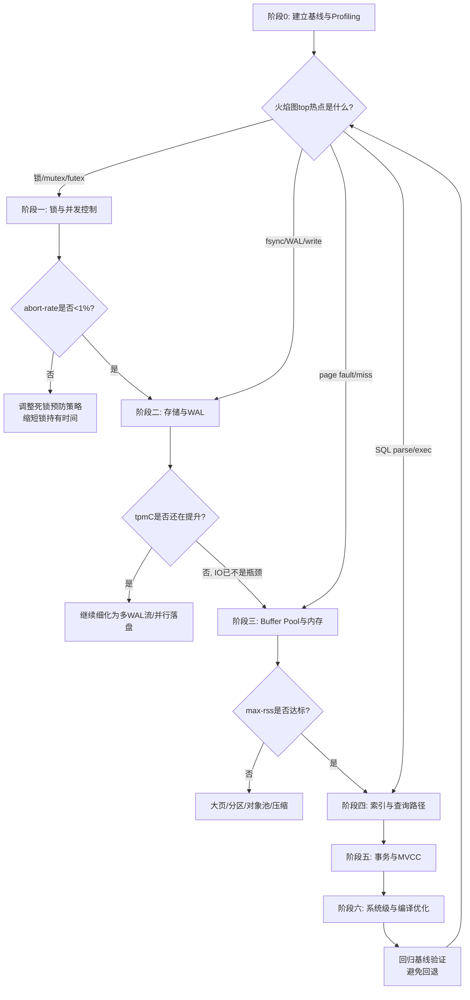

这是一份将两份报告深度融合后的完整优化指南。报告以宏观方法论为指导，以微观落地代码为支撑，既明确了“先看什么、后做什么”的战略路径，又给出了“怎么做、如何保正确性”的战术细节。

---

# 自研 C++ 关系型数据库 TPC-C 性能优化全阶路径与落地指南

## 导语与核心原则

进入性能优化阶段后，整体优先级建议遵循 **"先消除锁竞争与并发瓶颈 → 再优化存储与 WAL 落盘 → 再压榨 Buffer Pool 与内存带宽 → 接着打通索引与执行层 → 随后优化事务与 MVCC → 最后做 CPU 微观优化与编译/系统级调优"** 的顺序。

这一顺序的依据是：TPC-C 是高并发、小事务、强读写混合的 OLTP 负载，其性能天花板首先被锁竞争卡住，其次是 fsync 串行化点，再次是缓存命中与内存局部性，最后才是单指令级的 CPU 效率。在三个核心指标中，**tpmC 是主目标，abort-rate 反映并发控制算法的健壮性，max-rss-gb 反映内存效率与可扩展性**，三者需要在不同阶段分别盯防。

整体优化铁律是：**凡是涉及持久性与隔离性的优化（Group Commit、Checkpoint、MVCC GC、WAL 先行）都必须保留原协议语义，只动实现路径不动正确性边界。**

### 优化全景图

```mermaid
mindmap
  root((tpmC优化落地点))
  S1[阶段一: 锁与并发控制]
    锁管理器分片化
    死锁预防策略选择
    锁粒度与热点行分解
    latch与lock严格分离
  S2[阶段二: 存储与WAL落盘]
    Group Commit三阶段流水线
    Commit Pipeline异步化
    并行redo多log stream
    fsync与Fuzzy Checkpoint
  S3[阶段三: Buffer Pool与内存]
    多级分片BP与LRU-K
    NUMA感知与显式大页
    异步预读与后台刷盘
  S4[阶段四: 索引与查询路径]
    B+树乐观latch OLFIT
    SMO自底向上加锁
    覆盖索引与执行计划缓存
  S5[阶段五: 事务管理与MVCC]
    时间戳批量分配
    版本链与可见性
    GC安全点回收
  S6[阶段六: CPU微优化与系统调优]
    cache line对齐与EBR
    绑核NUMA调度
    LTO+PGO编译
```

---

## 一、优化前的准备：建立基线与 Profiling 方法论

**没有可重复的基线和可信的画像，所有优化都是盲调。** 在动手之前必须先完成以下工作：

**1. 建立可复现的 tpmC 基线。** 使用 BenchmarkSQL 跑 TPC-C，仓库数决定成绩上限不能太低；测试时长要足够长（数据库大小超过 shared buffer 3 倍后性能会明显下降，此时才能暴露长稳问题）；用 htop 监控服务端与客户端 CPU，最佳状态下各核利用率应尽可能高且均衡。同时固定并发数、隔离级别（TPC-C 推荐 RC）、limitTxnsPerMin 等参数，确保每次对比变量单一。

**2. 构建 Profiling 工具链（必备三件套）：**
- **perf + 火焰图**：`perf record -F 99 -g -p <PID>` 生成 SVG，定位 CPU 热点函数。热点宽度超过 10% 即值得优先优化。
- **perf lock / off-CPU 火焰图**：量化锁竞争强度与上下文切换，记录锁等待链。
- **业务级监控**：Buffer Pool 命中率、脏页比例、WAL 写入带宽、fsync 次数、锁等待队列长度、事务 abort 原因分布。

**3. 理解 TPC-C 负载特征。** New-Order (45%) 和 Payment (43%) 是吞吐主体。Payment 主要更新 Warehouse 与 District 的 YTD 字段——**Warehouse/District 是天然热点行**，并发数大于仓库数时，更新 Warehouse.W_YTD 会成为锁竞争瓶颈，这也是 abort-rate 的主要来源。

### 优化决策流程



---

## 二、各阶段优化措施对照表

| 阶段 | 核心目标 | 关键优化手段 | 主要影响指标 | 验证方法 |
|------|---------|------------|------------|---------|
| 1. 锁与并发 | 消除 latch/lock 串行点 | 锁管理器分片、死锁预防切换、热点行拆分 | tpmC↑、abort-rate↓ | perf lock 等待下降 |
| 2. 存储与 WAL | 消除 fsync 串行化 | Group Commit、异步 Pipeline、并行 redo | tpmC↑ | fsync 次数/秒下降 |
| 3. BP 与内存 | 提高命中率、降 RSS | 多级分片 BP、LRU-K、NUMA、显式大页 | tpmC↑、max-rss↓ | 命中率>99%、RSS 稳定 |
| 4. 索引与执行 | 降索引与 CPU 开销 | OLFIT 乐观 latch、执行计划缓存、覆盖索引 | tpmC↑ | 火焰图 parser/exec 占比下降 |
| 5. 事务与 MVCC | 消除全局结构瓶颈 | TS 批量分配、GC 安全点、OCC/2PL 混合 | abort-rate↓、rss↓ | 版本链内存回收正常 |
| 6. CPU 与系统 | 压榨单核效率 | 绑核、LTO/PGO、cache line 对齐 | tpmC↑ | 单核 tpmC 提升 |

---

## 三、阶段一：锁与并发控制（最高优先级）

这是 TPC-C 性能的第一道天花板。几乎所有并发控制方案在多核下的主要瓶颈都是 locks 与 latches 的维护开销。

**1. 锁管理器分片化**
- **手段**：按 `(table_id, page_id, slot_id)` 计算 hash，映射到 N 个独立 shard，每个 shard 自带 mutex + lock hash table。shard 数量取 CPU 物理核数的 2~4 倍。
- **实现要点**：锁对象从对象池预分配，acquire/release 只做链表指针操作，严禁在临界区内 malloc；每个 shard 的 mutex 用 `alignas(64)` padding 隔离，防止 false sharing。
- **一致性保障**：2PL 协议本身不变，只是把"谁负责管理某个锁"做了路由分片，逻辑等价于一个全局锁表，可串行性不受影响。

**2. 死锁预防策略选择与切换**
- **策略**：Wait-Die 适合中等争用；Wound-Wait 适合高争用且希望老事务优先完成；NO-Wait 适合极低争用。
- **落地建议**：默认 Wound-Wait（abort 数更少），同时维护 wait-for 图做轻量级 DL_DETECT 兜底；当检测到 lock thrashing（平均锁等待队列长度超阈值）时自动切到 NO-Wait 模式。
- **一致性保障**：三种策略都保证可串行化，区别仅在 abort 哪个事务。abort 的事务必须完整回滚（undo 全部修改）才能保证一致性。

**3. 锁粒度与热点行分解**
- **手段**：行级锁优先于页级锁；表访问用意向锁（IS/IX）避免表锁阻塞。
- **热点打散**：TPC-C 的 `Warehouse.W_YTD` 是写热点。可考虑把 YTD 拆为多个子账户（如 10 个 sub-YTD），Payment 事务按 `w_id % 10` 选子账户更新，把单行热点打散为 10 行——这是逻辑层优化，不影响总额一致性（子账户之和 = 原 YTD）。
- **缩短锁持有**：commit 阶段释放所有行锁后再做后续清理；统计更新移出锁临界区，用 atomic counter 异步累加。

**4. B+ 树 latch 优化与 lock 分离**
- **latch 与 lock 严格分离**：latch 保护物理结构（微秒级，无死锁检测）；lock 保护逻辑事务隔离（毫秒到秒级，有死锁处理）。**严禁用 latch 代替 lock**。
- **乐观 latch crabbing**：插入/删除时先一路读锁下探到叶子，若叶子"安全"（不会触发 split/merge）则只加叶子写锁完成操作；不安全才回退到悲观 crabbing。SMO（分裂/合并）改为自底向上加锁，缩短上层持锁时间。

---

## 四、阶段二：存储与 WAL 落盘

锁瓶颈消除后，fsync 串行化成为下一道天花板。此阶段必须死守"WAL 先行"原则：数据页落盘前，对应 redo log 必须已 fsync 成功。

**1. Group Commit 三阶段流水线**
- **实现**：分为 FLUSH_STAGE → SYNC_STAGE → COMMIT_STAGE。FLUSH 阶段 leader 将 redo 写入 WAL buffer；SYNC 阶段 leader 执行一次 fsync，所有 follower 阻塞等待；COMMIT 阶段通知各 follower 提交并释放锁。
- **批次触发**：时间阈值（200μs~1ms）或数量阈值（16~64 个事务），先到先触发。注意 batch size 过大可能限制磁盘并发，需根据并发量压测最优值。
- **一致性保障**：fsync 在 COMMIT 阶段之前完成，事务对外可见时 redo 已落盘；崩溃恢复时未 fsync 的事务自动回滚，不破坏持久性。

**2. Commit Pipeline 异步化**
- **实现**：事务进入 pipeline 前并发更新 memtable（不阻塞彼此），pipeline 内异步持久化 WAL entry，多个 entry 的 fsync 时间窗口可重叠。
- **关键设计**：WAL entry 落盘前，事务状态保持"pre-commit"对外不可见；落盘后批量置为"committed"并唤醒等待该事务的读请求。
- **一致性保障**：pre-commit 状态在崩溃恢复时按未提交处理（回滚），committed 状态才重放——等价于把 fsync 从事务关键路径上摘除，但保留持久性语义。

**3. 并行 redo / 多 log stream**
- **实现**：WAL buffer 按 `txn_id % N` 或 `(table_id, partition_id)` hash 到 N 个 log stream，每个 stream 独立 writer 线程并发 fsync。全局 LSN 维护跨 stream 顺序：每个 log entry 记录 `(stream_id, local_lsn, global_lsn)`。
- **一致性保障**：单事务的 redo 必须落在同一 stream 内保证局部有序；跨事务的串行化序由 global_lsn 决定，恢复时严格按 global_lsn 重放即可保证可串行性。

**4. fsync 与文件层优化**
- 用 `fdatasync()` 替代 `fsync()`（不刷修改时间等元数据）；WAL 文件用 `fallocate()` 预分配固定大小避免运行时碎片；WAL 文件轮转避免单文件 inode 锁竞争；若 BP 自管缓存，可对 WAL 开 `O_DIRECT` 绕过 page cache。

**5. Checkpoint 与长稳问题**
- **Fuzzy Checkpoint**：记录 checkpoint LSN 时允许并发修改，不阻塞事务。
- **增量刷脏**：后台 flush 线程持续把脏页写回，控制脏页比例在 75%~85%，避免 checkpoint 时批量刷盘造成延迟尖刺。TPC-C 长跑时若 WalWriter CPU 占满 100%、tpmTotal 下降，即需优化 flush 线程调度。
- **一致性保障**：checkpoint LSN 之前的 WAL 可裁剪；恢复时从最近 checkpoint LSN 开始重放 redo，之后应用 undo 回滚未提交事务（标准 ARIES 协议）。

---

## 五、阶段三：Buffer Pool 与内存

存储层优化到位后，瓶颈转移到缓存命中与内存带宽。TPC-C 一次事务可能涉及数十次读 IO，命中率每降 1% 都会显著拖累 tpmC。

**1. 多级分片 Buffer Pool**
- 按 `page_id % N` 分片到 N 个 instance，每个 instance 独立 LRU + free list + flush list + mutex（N = CPU 物理核数）。前台线程 fetch page 时只锁对应 instance。pin/unpin 协议不变，分片只是把访问路径拆开。

**2. 替换策略升级 (LRU-K 与冷热分区)**
- **LRU-K (K=2)**：跟踪每个 page 最近 2 次访问时间，按"第 K 次距今时间"淘汰，能区分"偶尔被扫一次"和"真正热点"，避免全表扫描污染。
- **冷热分区**：LRU 链表分为 new sublist（热，占 3/8）和 old sublist（冷，占 5/8），新载入 page 先进 old，被第二次访问才晋升 new。

**3. NUMA 感知与显式大页**
- **NUMA 感知**：Buffer Pool 按 NUMA 节点分区，线程优先从本节点 instance 取 page。内存分配用 `numa_alloc_onnode` 或 `mmap + MPOL_BIND`。openGauss MOT 为每表行、每索引节点从本地 NUMA 节点以 2MB chunk 分配，事务内存分配始终 NUMA-local。
- **显式大页**：大内存下 4KB 页会导致大量 TLB miss。启用 2MB 显式大页可减少 TLB 开销，实测带来 5%~30% 吞吐提升。
- **注意**：若 max-rss-gb 敏感，**关闭 THP（透明大页）改用显式大页**——THP 可能导致 RSS 异常膨胀。

**4. 异步预读与后台刷盘**
- 顺序访问检测：连续 page 读取超过阈值（如 8 页）触发异步预读批量加载；独立 flush 线程按 dirty page ratio 与 redo 生成速率动态刷盘，避免前台事务同步刷脏。

---

## 六、阶段四：索引与查询路径

并发与 IO 打通后，CPU 开销占比凸显。TPC-C 的 New-Order 每次插入涉及多表索引更新，索引并发与 SQL 解析性能直接影响 tpmC。

**1. B+ 树乐观 latch（OLFIT）**
- **读操作无锁化**：读版本号 → 读 node 内容 → 再读版本号，两次一致则成功；不一致则重试。
- **写操作**：持写锁修改，完成后版本号 +1，使并发读者检测到变化而重试。内部节点全程乐观读，只在叶子节点加写锁——根节点不再成为热点。
- **一致性保障**：版本号验证保证读者看到一致的 node 快照；SMO 期间仍持悲观锁，保证树结构完整性。

**2. 覆盖索引与索引下推**
- TPC-C Order-Status 事务按 `(w_id, d_id, c_id)` 查询，建覆盖索引把 `o_id, o_carrier_id, o_entry_d` 纳入索引避免回表。把 WHERE 条件下推到索引扫描层，在索引层过滤不满足条件的行。二级索引与主表由同一事务同步维护，不影响一致性。

**3. 执行计划与 PreparedStatement 缓存**
- 实现 SQL prepare 结果缓存、执行计划缓存。TPC-C 事务由固定模板 SQL 组成，缓存命中率接近 100%，可省去大量 parser 与优化器开销。

**4. 乐观开表复用与协程化**
- 维护连接私有缓存，若访问表是缓存子集则复用已缓存的元信息与 MDL 锁。用协程将请求与物理线程解耦，单线程并行处理数百协程，配合 eventfd 实现零无效唤醒。

---

## 七、阶段五：事务管理与 MVCC

事务系统本身的全局数据结构（活跃事务表、时间戳分配器）在多核下也会成为瓶颈。

**1. 时间戳批量分配**
- 全局 timestamp oracle 每次分配一段（如 1000 个 TS），用完再申请。单机场景用 `std::atomic<uint64_t>::fetch_add(batch_size)` 一次取一批，本地线程内分发。TS 单调递增保证可串行化序，只是减少争用。

**2. MVCC 版本链与可见性**
- 每个元组维护版本链，记录 `txn_id, commit_ts, prev_version_ptr`。读事务以自己的 `start_ts` 为快照，只看 `commit_ts <= start_ts` 的版本。版本链头指针更新用 CAS，写事务追加新版本时不阻塞读事务。

**3. 垃圾回收（GC）安全点**
- 维护全局 `min_active_txn_ts`（最老活跃事务的 start_ts），所有 `commit_ts < min_active_txn_ts` 的旧版本可安全回收。GC 线程周期性扫描版本链回收内存。只回收"没有任何活跃事务可能看到"的版本，等价于全局 quiescent point。

**4. OCC / 2PL 混合与 Savepoint**
- 低争用事务用 OCC（读时不加锁，commit 时验证写集）；高争用事务回退 2PL。事务内设置 savepoint，冲突时只回滚到 savepoint 而非整事务回滚（TPC-C 中 New-Order 的 1% 远程仓库事务可能因库存不足 abort，用 savepoint 可避免整事务重做）。

---

## 八、阶段六：CPU 微优化与系统级调优

最后一阶段是把单核效率压榨到极致，收益相对小但累积可观。

**1. cache line 对齐与 false sharing 消除**
- 热点共享结构（锁管理器 shard mutex、全局计数器）用 `alignas(64)` 对齐到 cache line。
- 代码示例：`struct Shard { alignas(64) std::mutex m; char pad[64 - sizeof(std::mutex)]; ... };`

**2. 无锁数据结构 + Epoch-Based Reclamation (EBR)**
- 读多写少的全局结构用 lock-free 实现；内存回收用 EBR：每个线程进入/退出临界区时刷新 epoch，旧节点延迟 3 个 epoch 后回收，保证不会 use-after-free。

**3. 绑核与 NUMA 调度**
- `numactl --cpunodebind=N --membind=N` 绑定数据库进程；网络中断也可用 `irqbalance` 或手动 `/proc/irq/*/smp_affinity` 绑到本地 CPU。

**4. 编译优化（LTO + PGO）**
- LTO（链接时优化）跨编译单元内联与死代码消除。PGO（运行时反馈优化）：先用 TPC-C 典型负载跑一遍生成 profile，再重新编译让编译器基于真实分支概率优化。
- 落地：`-fprofile-generate` → 跑 BenchmarkSQL → `-fprofile-use` 重新编译。实测 MySQL 用 LTO+PGO 提升高达 85%。

**5. 内核与文件系统参数**
- IO 调度器设为 `none`/`noop`（SSD/NVMe 场景）；XFS mount 选项 `noatime,nodiratime`；`vm.swappiness=1` 几乎禁止 swap；关闭 SQL 审计日志、慢日志等监控开关。

---

## 九、常见陷阱与权衡

1. **优化顺序倒置**：在锁竞争未消除前去做编译优化、在 fsync 串行未解决前去调 buffer pool 命中率，都属于"优化非瓶颈"，收益微乎其微。正确做法是每轮优化后回归基线，重新跑火焰图定位当前 top 热点。
2. **Group Commit 与延迟的权衡**：batch 越大吞吐越高，但单事务 commit 延迟也越高。需结合 TPC-C 的 90% 响应时间要求权衡。
3. **锁粒度与死锁的权衡**：分片越细并发越高，但死锁检测的 wait-for 图越分散；NO_WAIT 类策略 abort-rate 高但无死锁。建议低争用用检测、高争用用预防。
4. **大页与 RSS 的权衡**：THP 可能导致 RSS 膨胀，对 max-rss-gb 敏感场景必须改用显式大页。
5. **NUMA 亲和与负载均衡的权衡**：过强的 NUMA 亲和可能导致某节点内存耗尽而其它节点空闲，需在亲和与均衡间取折中。

---

## 十、推荐落地优先级清单

按"投入产出比 + 风险可控性"排序，建议按以下顺序逐项落地，每项做完回归 tpmC/abort-rate/max-rss 三指标：

1. **锁管理器分片化**（阶段一）— 通常 tpmC 直接翻倍，风险低
2. **Group Commit 三阶段流水线**（阶段二）— fsync 次数骤降，tpmC 显著提升
3. **B+ 树乐观 latch OLFIT**（阶段四）— 消除索引根节点热点
4. **多级分片 Buffer Pool + LRU-K**（阶段三）— 命中率提升 + latch 争用下降
5. **MVCC 时间戳批量分配 + GC 安全点**（阶段五）— abort-rate 下降，RSS 稳定
6. **Commit Pipeline 异步化**（阶段二）— 进一步压榨提交路径
7. **NUMA 感知 + 显式大页**（阶段三）— 多路服务器收益巨大
8. **死锁预防策略切换 + 热点行分解**（阶段一）— 降 abort-rate
9. **执行计划缓存**（阶段四）— 降 CPU
10. **LTO + PGO + cache line 对齐**（阶段六）— 锦上添花

**验收硬性标准**：每一项优化后必须用同一基线回归验证：tpmC 不降、abort-rate 不升、max-rss 不膨胀，且 crash recovery 测试（`kill -9` 后重启）能正确恢复到一致状态。

整个优化过程本质上是"测量—假设—验证"的循环：火焰图与 perf lock 给出假设，代码改动验证假设，基线指标确认收益，然后进入下一轮。坚持这个循环，tpmC 会呈现阶梯式爬升，而 abort-rate 与 max-rss-gb 也会在各自阶段被逐步压到合理区间。
