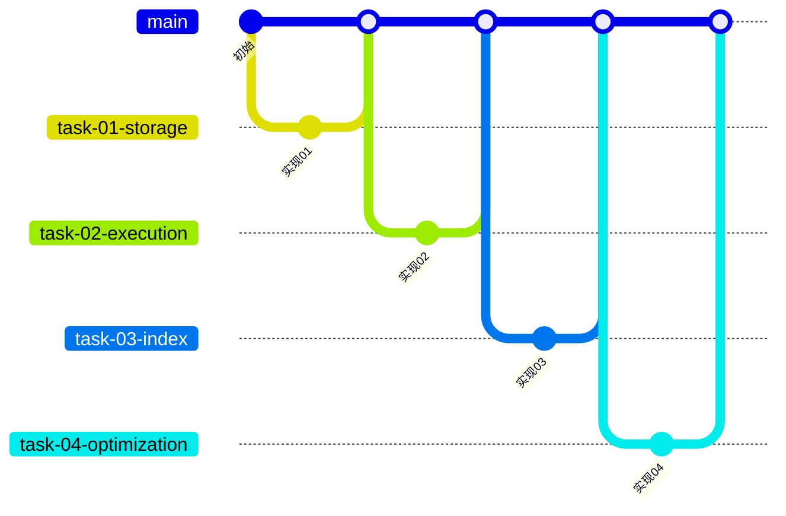
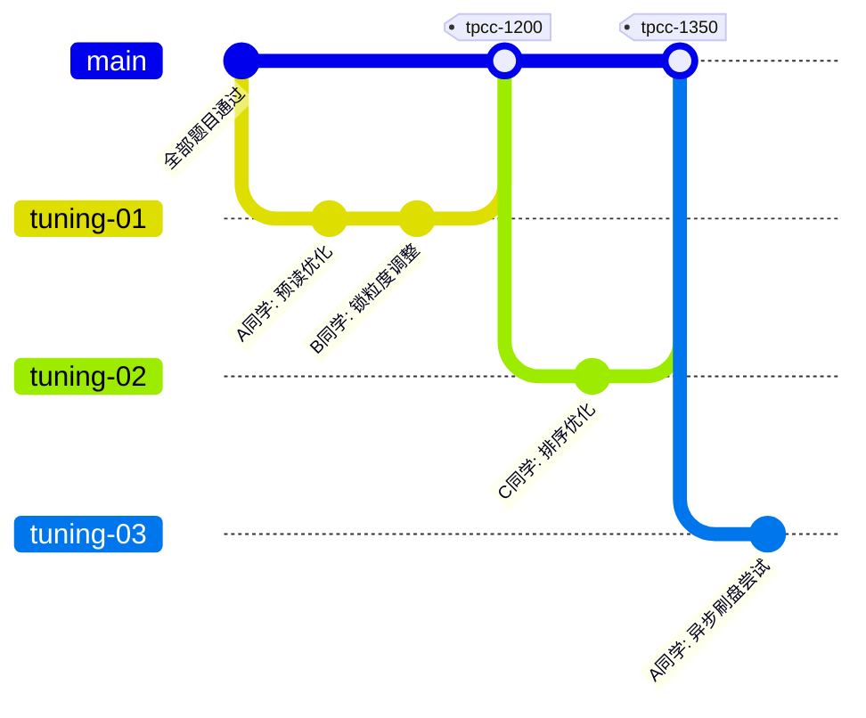

# RMDB 项目 Git 协作规范

## 分支策略

### 分支命名

```
初赛: task-<编号>-<短名>
调优: tuning-<序号>              （每轮调优一个分支，合入 master 后打 tag 标记分数）
```

| 题目 | 分支名 | 涉及模块 |
|------|--------|----------|
| 题目一：存储管理 | `task-01-storage` | DiskManager, LRUReplacer, BufferPoolManager |
| 题目二：查询执行 | `task-02-execution` | Execution 算子 |
| 题目三：唯一索引 | `task-03-index` | Index Manager (B+ 树) |
| 题目四：查询优化与执行 | `task-04-optimization` | Optimizer, Execution |
| 题目五：聚合函数与分组统计 | `task-05-aggregate` | Execution (聚合算子) |
| 题目六：Union 集合算子 | `task-06-union` | Execution (Union 算子) |
| 题目七：嵌套循环连接及其优化 | `task-07-join` | Execution (Join 算子), Optimizer |
| 题目八：事务控制语句 | `task-08-transaction` | TransactionManager, LockManager |
| 题目九：快照隔离与可串行化 | `task-09-isolation` | TransactionManager (MVCC) |
| 题目十：基于静态检查点的故障恢复 | `task-10-recovery` | LogManager, RecoveryManager |

### 分支工作流

1. 从 master 最新提交创建 `task-<编号>-<短名>`，三人聚焦此分支共同开发
2. 该题所有代码、测试、文档修改都在同一分支内完成，完成后合并回 master
3. 基于新 master 开下一题分支，以此类推

<!-- Mermaid gitGraph 规则：同一张图内所有 commit id 必须唯一，不可重复 -->



## Commit 规范

### 格式

```
type(scope): 中文描述

- 详细描述1
- 详细描述2
- ...
- 备注说明...
```

- **第一行必填**：`type(scope): 中文描述`，聚焦一个变更意图
- **后续行可选**：需要补充细节、说明原因、记录数据时以 `- ` 无序列表开头列出；改动简单明确时可以不写。每条内容不可以大段描述，保持简洁总结。

### type 取值

| type | 含义 | 适用场景 |
|------|------|----------|
| `feat` | 新增功能 | 实现模块接口、新增算子、填充 TODO 方法 |
| `fix` | 缺陷修复 | 修复 bug、测试失败、逻辑错误 |
| `ref` | 重构优化 | 调整代码结构、提取公共逻辑、优化实现 |
| `perf` | 性能调优 | 提升吞吐、降低延迟、减少内存占用，需在描述中记录分数变化 |
| `test` | 测试代码 | 新增或修改测试用例、测试脚本 |
| `doc` | 文档更新 | 补充或修正文档、注释、规范 |
| `file` | 文件变更 | 移动、重命名、删除文件 |
| `chore` | 构建/配置 | CMakeLists、依赖、gitignore、CI 配置 |

### scope 取值

scope 可以是题目编号或模块名，按以下优先级决定：

- **feat / fix / ref**：有题目标识时用 `t01` 等，无则用模块名
- **perf**：始终用模块名

题目标记：`t01`（存储管理）`t02`（查询执行）`t03`（唯一索引）`t04`（查询优化）`t05`（聚合函数）`t06`（Union）`t07`（嵌套循环连接）`t08`（事务）`t09`（隔离级别）`t10`（故障恢复）

scope 使用项目模块名，能快速识别影响范围：

| scope | 对应目录/模块 |
|-------|-------------|
| `storage` | `src/storage/` — DiskManager, BufferPoolManager |
| `lru` | `src/replacer/` — LRUReplacer |
| `record` | `src/record/` — Record Manager |
| `index` | `src/index/` — Index Manager |
| `execution` | `src/execution/` — 查询算子 |
| `optimizer` | `src/optimizer/` — 查询优化器 |
| `analyze` | `src/analyze/` — 语义分析 |
| `transaction` | `src/transaction/` — 事务与锁 |
| `recovery` | `src/recovery/` — 日志与恢复 |
| `system` | `src/system/` — 元数据管理 |
| `test` | `our-test/`、`src/unit_test.cpp` |
| `doc` | `doc/`、`problem/` |
| `config` | CMakeLists、`.gitignore`、`.claude/` |

### 文件分组规则

分析改动时，按文件路径自动归组。不同组的改动必须拆成独立 commit，每组一个 commit。

| 组别 | 文件范围 | 提交 type |
|------|---------|:---------:|
| 源码 | `src/` | `feat`/`fix`/`ref`/`perf` |
| 测试 | `test/`、`our-test/` | `test` |
| 文档 | `docs/` | `doc` |
| 脚本 | `scripts/` | `chore(scripts)` |
| 配置 | `.gitignore`、`.claude/`、`CMakeLists.txt` 等 | `chore(config)` |
| 文件 | 移动/重命名/删除 | `file` |

跨组改动时，清单中列出多个 commit，按组分批执行。

### scope 上下文推断

从对话中匹配以下模式提取题号：`t01`、`第 1 题`、`task-01`、`题目1` 等。对话中未涉及任何题目时，不强制添加题号，生成一个不带题号的备选 message，在清单末尾标注询问用户确认。

### 正确示例

```
feat(t01): 实现 DiskManager 文件读写与页面管理
feat(t02): 实现顺序扫描算子
fix(t03): 修复 B+ 树唯一键冲突崩溃
ref(t04): 提取谓词下推公共逻辑
perf(storage): 优化 BufferPool 预读策略，TPC-C 1200→1350
feat(lru): 实现 LRU 淘汰策略的 victim/pin/unpin
feat(record): 实现 RmFileHandle 记录增删改查
feat(index): 实现 B+ 树 insert_entry 含节点分裂
fix(execution): 修复嵌套循环连接空表崩溃问题
ref(optimizer): 提取谓词下推公共逻辑
test(storage): 新增 BufferPoolManager 并发测试
doc(problem): 补充题目三索引约束说明
chore(config): 更新 CMake 最低版本至 3.16
perf(execution): 将 Sort 算子改为内存排序，TPC-C 1350→1420

# 带正文的示例
feat(execution): 实现嵌套循环连接 Join 算子

- 支持 INNER JOIN 和 LEFT JOIN
- 左表为外表，右表为内表，按连接条件逐行匹配
- 未实现索引连接优化，全表扫描
```

`perf` 类型的分数记录也可放在正文：

```
perf(storage): 尝试异步刷盘

- 将 DiskManager::write_page 改为异步写入
- 使用 std::async 后台刷盘，不阻塞主线程
- TPC-C 分数: 1420 → 1435
```

## 两阶段工作流

RMDB 项目由 3 人协作完成 10 道赛题，三人一起做同一道题、聚焦同一个分支，逐题推进。分为两个阶段：

- **初赛**：逐题通过正确性测试，每道题一个分支，通过在线检测后合并。
- **调优**：全部题目通过后提升 TPC-C 跑分，自由探索、择优整合。

### 初赛阶段：通过正确性

按题目依赖顺序，每道题在 `task-<编号>-<短名>` 分支上完成实现，目标是**通过在线检测的所有测试用例**。通过后合并到 master。

### 调优阶段：提升 TPC-C 跑分

全部题目通过后进入调优。三人自由探索，各自或合作开 `tuning-<序号>` 分支尝试优化，谁的方案效果好就用谁的，协商择优整合。得分有突破后**合入 master 并在 master 上打 tag**。

**协作原则：**

- 不排他，谁有思路谁就开分支试
- 分支代码过时了没关系，后续协商整合最优方案即可
- 只要 master 处于最新、可提交状态就行，旧分支只是记录，不必维护
- 提交什么内容、提交哪个分支完全由大家自己决定

**工作流：**



**操作步骤：**

1. 从 master 创建 `tuning-01`，优化后 push 提交给平台
2. 平台返回分数，有突破 → 合入 master，在 master 上打 tag：
   ```
   git checkout master
   git merge tuning-01
   git tag -a tpcc-1200 -m "tuning-01: 预读优化 + 锁粒度调整，得分 1200"
   git push origin master --tags
   ```
3. 从 master 创建下一轮 `tuning-N` 继续，以此类推

**关键规则：**

- **tag 只打在 master 上**，不在 tuning 分支上打 tag
- 分数突破才合入 master；分数不变或倒退的 tuning 分支**不合并、不删除**，保留作为探索记录
- 下一轮 tuning 从**当前 master** 开出
- 往后看，不回溯修旧分支的 bug；旧分支只是标记记录

## 协作规则

### 开发前
1. 三人确认当前要做的题目，从 master 最新提交创建 `task-<编号>-<短名>` 分支
2. 先写测试（参考 `.claude/memory/test-writing-workflow.md`），确保初始测试 FAIL

### 开发中
1. 三人聚焦同一分支，小步提交，一个逻辑改动一次 commit，不混搭
2. commit message 遵循上述格式，scope 精确到具体模块
3. push 前先 `git pull --rebase origin master` 同步主分支

### 合并到 master
1. 由一人发起 Pull Request
2. **另外两人必须 approve** 后才能合并
3. 合并后删除远程分支，本地分支按需保留

### 提交平台
- 提交哪个分支、提交什么内容由大家自行决定

## 禁止事项

- **禁止** 跨题目共用分支（一题一分支，不混搭）
- **禁止** 跳过测试直接提交实现代码
- **禁止** commit 中混入构建产物（`build/` 已在 `.gitignore` 中）
- **禁止** 使用 `--no-verify` 或 `--force` 绕过检查
