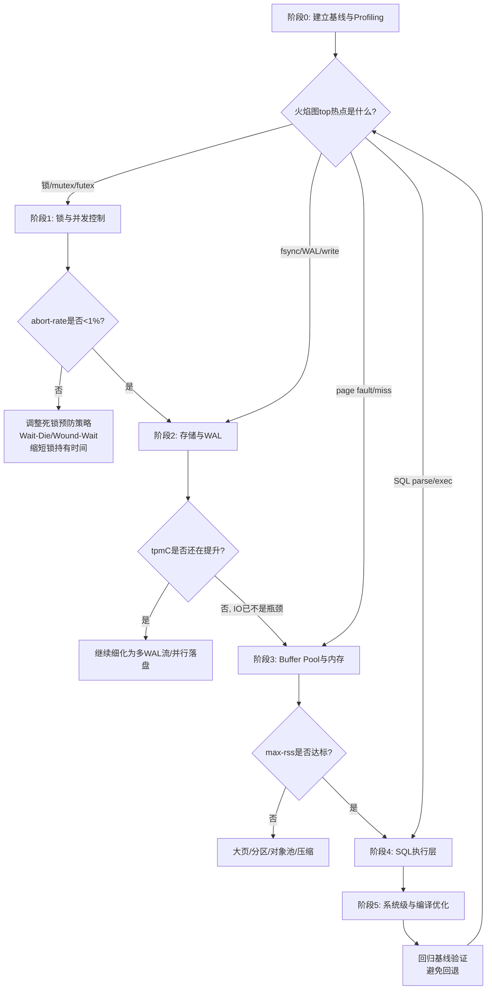

# 自研 C++ 关系型数据库 TPC-C 性能优化路径

进入性能优化阶段后，整体优先级建议遵循 **"先消除锁竞争与并发瓶颈 → 再优化存储与 WAL 落盘 → 再压榨 Buffer Pool 与内存带宽 → 最后做 CPU 微观优化与编译/系统级调优"** 的顺序。这一顺序的依据是：TPC-C 是高并发、小事务、强读写混合的 OLTP 负载，其性能天花板首先被锁竞争（逻辑锁与 latch）卡住，其次是 fsync 串行化点，再次是缓存命中与内存局部性，最后才是单指令级的 CPU 效率【turn2search3】【turn0search19】。在三个核心指标中，tpmC 是主目标，abort-rate 反映并发控制算法的健壮性，max-rss-gb 反映内存效率与可扩展性，三者需要在不同阶段分别盯防。

## 一、优化前的准备：建立基线与 Profiling 方法论

**没有可重复的基线和可信的画像，所有优化都是盲调。** 在动手之前必须先完成以下工作。

**1. 建立可复现的 tpmC 基线。** 使用 BenchmarkSQL 跑 TPC-C，关键要点包括：仓库数（warehouses）决定成绩上限，不能太低；测试时长要足够长（一般数据库大小超过 shared buffer 3 倍后性能会明显下降，此时才能暴露长稳问题）；用 htop 监控服务端与客户端 CPU，最佳状态下各核利用率应尽可能高且均衡，若有核未达标通常是绑核或锁竞争问题【turn0search3】【turn0search9】。同时固定并发数、隔离级别（TPC-C 推荐 RC，RR 下容易出现锁等待超时）、limitTxnsPerMin 等参数，确保每次对比变量单一【turn0search4】【turn0search11】。

**2. 构建 Profiling 工具链。** 这是整个优化阶段的"眼睛"，必备三件套：

- **perf + 火焰图（On-CPU）**：`perf record -F 99 -g -p <PID>` 采样后用 `stackcollapse-perf.pl | flamegraph.pl` 生成 SVG，定位 CPU 热点函数。热点函数宽度超过 10% 即值得优先优化【turn1search9】【turn1search10】【turn1search14】。
- **perf lock / off-CPU 火焰图**：定位锁等待与上下文切换。`perf lock` 可量化锁竞争强度，配合 eBPF 可记录上下文切换与锁等待链【turn1search16】【turn1search12】。
- **业务级监控**：Buffer Pool 命中率、脏页比例、WAL 写入带宽、fsync 次数、锁等待队列长度、事务 abort 原因分布。这些指标决定下一步往哪个模块深挖。

**3. 理解 TPC-C 负载特征与三个指标的关联。** TPC-C 的 9 张表与 5 类事务中，New-Order 占 45%、Payment 占 43%，两者是吞吐主体【turn1search48】。New-Order 主要写 New-Order 表与 Order-Line、更新 Stock；Payment 主要更新 Warehouse 与 District 的 YTD 字段——**Warehouse/District 是天然热点行**，并发数大于仓库数时，更新 Warehouse.W_YTD 会成为锁竞争瓶颈，这也是 abort-rate 的主要来源【turn2search3】。因此优化时要重点关注这两类事务的锁路径与索引路径。

下面用一张图展示完整的优化决策流程：

## 二、各阶段优化措施对照表

| 阶段 | 核心目标 | 关键优化手段 | 主要影响指标 | 验证方法 |
|------|---------|------------|------------|---------|
| 1. 锁与并发控制 | 消除 latch/lock 串行点 | 分片锁管理器、锁表分区、死锁预防策略、B+树 latch crabbing | tpmC↑、abort-rate↓ | perf lock 等待下降、火焰图锁占比下降 |
| 2. 存储与 WAL | 消除 fsync 串行化 | Group Commit、Commit Pipeline、并行 redo、fdatasync、WAL 预分配 | tpmC↑ | fsync 次数/秒下降、WAL 带宽提升 |
| 3. Buffer Pool 与内存 | 提高命中率、降低 RSS | 多级分片 BP、NUMA 感知、大页、LRU 冷热分区、对象池 | tpmC↑、max-rss↓ | 命中率>99%、RSS 稳定不膨胀 |
| 4. SQL 执行层 | 降低单事务 CPU 开销 | 执行计划缓存、PreparedStatement、开表复用、批量预取 | tpmC↑ | 火焰图 parser/exec 占比下降 |
| 5. 系统级与编译 | 压榨单核效率 | 绑核、NUMA 调度、LTO/PGO、prefetch、cache line 对齐 | tpmC↑ | 单核 tpmC 提升、TLB miss 下降 |

## 三、第一阶段：锁与并发控制（最高优先级）

这是 TPC-C 性能的第一道天花板。研究显示，几乎所有并发控制方案在多核下的主要瓶颈都是 **locks 与 latches 的维护开销**，即使没有实际争用也会发生；当仓库数小于并发线程数时，Warehouse 表更新争用会导致 2PL 类算法性能崩溃【turn2search3】。

**1. 锁管理器分片化。** InnoDB 在 8.0.21 之前用单一 `lock_sys->mutex` 保护全局 rec_hash，高并发下成为瓶颈；8.0.21 后改为 sharded lock system，按 record hash 分区到多个 latch，显著降低争用【turn2search8】【turn2search11】。自研数据库应直接采用分片 hash 表管理行锁，每个 shard 独立 mutex，并按 cache line padding 防止 false sharing。更激进的做法参考"A Scalable Lock Manager for Multicores"：锁对象批量预分配、批量释放，acquire/release 阶段只做链表操作，避免运行时 malloc【turn2search15】。

**2. 死锁预防策略与 abort-rate。** 死锁检测（DL_DETECT）在高争用下会遇到 lock thrashing；NO_WAIT 可扩展但 abort-rate 高；Wait-Die/Wound-Wait 是经典折中。对 TPC-C 这类工作负载，建议低争用用 DL_DETECT，检测到 thrashing 时切换到 NO_WAIT 或基于 T/O 的方案【turn2search3】【turn3search9】。**关键经验**：abort-rate 升高时，先排查是否是死锁预防策略在中止"本可等待"的事务——Brook-2PL 等新方案指出传统预防机制会中止比必要更多的事务，浪费已完成的计算【turn3search5】。

**3. B+ 树 latch 优化。** 传统 latch crabbing 每次插入/删除都从根节点加写锁，根节点成为热点。应采用 **乐观 latch**：先一路读锁下探到叶子，仅在叶子加写锁；若叶子不安全（不会 split/merge）则直接完成，否则回退到悲观 crabbing 重做。PolarDB 的 PolarIndex 进一步将 SMO（分裂/合并）改为自底向上加锁、单节点持锁，允许 SMO 期间并发读写【turn2search38】【turn2search40】【turn2search32】。对热点索引根/枝节点，可考虑 hash 分区索引打散【turn2search44】。极致方案是 Bw-tree 这类 latch-free 索引，但实现复杂度高【turn2search45】。

**4. 减少锁内操作。** 把内存分配、IO 等耗时操作搬出热锁保护范围；共享内存池改为线程本地内存池，避免 malloc 的 futex 争用【turn1search12】。

## 四、第二阶段：存储与 WAL 落盘

锁瓶颈消除后，fsync 串行化成为下一道天花板。TPC-C 高并发小事务下，每个 commit 一次 fsync 会让磁盘 I/O 成为瓶颈，WAL 刷盘开销直接决定 tpmC 上限【turn2search19】【turn2search21】。

**1. Group Commit（组提交）。** 这是最重要的单一优化手段：将多个事务的 WAL 日志在内存 buffer 中攒一批，用一次 fsync 落盘，把 O(n) 次 fsync 降为 O(1)【turn2search23】【turn1search20】。MySQL 将提交分为 FLUSH_STAGE / SYNC_STAGE / COMMIT_STAGE 三阶段流水线，阶段间可并发【turn2search22】。需注意 batch size 不是越大越好——达梦实测中关闭事务合并提交反而提升性能，因为过大的 batch 限制了磁盘读写并发；需根据并发量与磁盘能力压测最优值【turn0search17】。

**2. Commit Pipeline。** MatrixOne 等系统采用异步 commit pipeline：事务在进入 pipeline 前并发更新 memtable（不阻塞），pipeline 内异步持久化 WAL entry，多个 entry 的 fsync 时间可重叠【turn2search27】。这避免了提交线程阻塞等待 IO。

**3. 并行 redo 与 WAL 分片。** PolarDB 将 redo buffer 划分为多个分片，并发发出异步 IO，结合异步 redo prepare（对齐、checksum），redo 吞吐可达 4GB/s【turn2search30】。多 WAL 流（如 HBase 的 WAL group）也是同类思路，按 region/分区拆分 WAL 文件，消除单 WAL 写入瓶颈【turn2search20】。

**4. fsync 优化细节。** 优先用 `fdatasync()` 而非 `fsync()`（不刷元数据）；用 `fallocate()` 预分配 WAL 文件段，避免运行时文件扩展带来的锁与碎片【turn2search23】。DB2 还采用 XOR logging（优化 UPDATE）、Pseudo-Deletes（优化 DELETE）、Soft checkpoint（消除 checkpoint 阻塞）等手段【turn1search28】。

**5. 脏页刷盘与长稳问题。** TPC-C 长时间运行后，若脏页刷盘效率不足，WalWriter 线程 CPU 会占满 100%、其他核空闲、tpmTotal 持续下降——这是典型信号，需优化 flush 线程调度与 IO 并发【turn2search0】。控制脏页比例在 75%~85%，启用 adaptive flushing 让刷新速率匹配 redo 生成速度【turn0search27】。

## 五、第三阶段：Buffer Pool 与内存

存储层优化到位后，瓶颈转移到缓存命中与内存带宽。TPC-C 一次事务可能涉及数十次读 IO，命中率每降 1% 都会显著拖累 tpmC【turn2search30】。

**1. 多级分片 Buffer Pool。** 单一 LRU 链表在多核下 latch 争用严重。PolarDB 将访问拆分到多个 LRU 缓存，采用异步 LRU manager 线程做淘汰，前台线程不主动淘汰 page；并在 LRU 头部建 hot cache list，索引中间页、元数据页、热点表优先驻留，减少淘汰频率【turn2search30】【turn2search32】。InnoDB 也支持 buffer pool instances 分区，配合 `innodb_buffer_pool_instances` 调参【turn0search27】。

**2. NUMA 感知。** 多路服务器上，Buffer Pool 跨 NUMA 节点访问远程内存会显著增加延迟。NUMA-aware 的数据库引擎按节点分区 Buffer Pool，尽量让数据页留在最常访问它的线程所在节点；openGauss MOT 为每表行、每索引节点分配独立内存池，从本地 NUMA 节点以 2MB chunk 分配，事务内存分配始终 NUMA-local【turn1search32】【turn1search38】。GaussDB 在 NUMA 优化前 128 核 ARM 仅 110w tpmC，优化后达 180w/230w【turn0search1】。SQL Server 也按 NUMA 节点划分 buffer pool，每节点独立 lazy writer【turn1search36】。

**3. 大页（Huge Pages）。** 大内存下 4KB 页会导致大量 TLB miss。启用 2MB/1GB 大页可减少 TLB 开销、加速内存分配、提升带宽利用率，实测可带来 5%~30% 吞吐提升，数据库越大收益越显著【turn3search0】【turn3search1】【turn3search2】。但需注意 **THP（透明大页）可能导致 RSS 异常膨胀**，对 max-rss-gb 指标敏感时应改用显式大页或关闭 THP【turn3search4】。

**4. 内存占用与 max-rss-gb 控制。** 几个常见膨胀源：MVCC 版本链未及时回收、连接私有缓存过大、prepared statement 缓存按连接存储。PolarDB 将连接级结构缓存转为全局缓存，避免大量连接导致内存膨胀挤压 buffer pool【turn2search30】。对象池化、避免运行时 malloc、固定大小内存 arenas 都是控制 RSS 的有效手段。

**5. cache line 对齐与 false sharing。** 热点共享变量（如全局计数器、锁管理器 mutex）若与其它变量同处一个 cache line（通常 64 字节），多核修改会触发 cache line bouncing。应用 `alignas(64)` 或手动 padding 隔离热点变量【turn3search15】【turn3search16】【turn3search19】。

## 六、第四阶段：SQL 执行层

前三阶段把并发与 IO 打通后，CPU 开销占比就凸显出来。PolarDB 打榜时发现大量 SQL 解析执行与表访问仍消耗可观 CPU【turn2search30】。

**1. 执行计划与 PreparedStatement 缓存。** TPC-C 事务由数十条 SQL 组成，循环执行时重复 parse/prepare 开销巨大。实现 SQL prepare 结果缓存、执行计划缓存，对简单 SQL（单主键查询、无索引范围查询）基于统计信息固化执行路径，避免优化器下潜存储引擎【turn2search30】【turn1search24】。

**2. 乐观开表复用。** 传统悲观加锁每次执行 SQL 都要构建表元信息并加 MDL 锁。PolarDB 维护连接私有缓存，若访问表是缓存子集则复用已缓存的元信息与 MDL 锁，省去重复构建/销毁开销【turn2search30】。

**3. 批量与 prefetch。** 论文研究表明，batch 机制与基于协程的 prefetch 能减少后续计算的 cache miss，提升事务整体执行性能；这对内存计算与 IO 混合的 OLTP 引擎尤其重要【turn0search20】。

**4. 协程化全异步执行。** 传统线程模型下高并发请求导致 CPU 争抢与频繁上下文切换。PolarDB 用协程将请求与物理线程解耦，单线程并行处理数百协程，配合 eventfd 实现零无效唤醒、纳秒级响应【turn2search30】。

## 七、第五阶段：系统级与编译优化

最后一阶段是把单核效率压榨到极致，收益相对小但不可忽视。

**1. 绑核与 NUMA 调度。** 用 `taskset`/`numactl` 将数据库进程绑定到特定 NUMA 节点，避免内存跨节点访问；网络中断也可做 locality-aware 映射【turn2search1】。鲲鹏服务器上绑核收益明显【turn0search11】。

**2. 编译优化。** LTO（链接时优化）与 PGO（运行时反馈优化）对 C++ 数据库收益可观，PolarDB 大赛参赛者通过 PGO 获得显著提升【turn2search33】。注意关闭调试符号、assert 与日志。

**3. 文件系统与 IO 调度。** XFS mkfs/mount 优化（条带大小对齐数据库块大小、noatime/nodiratime）、IO 调度器用 NOOP/none（SSD 场景减少 CPU 开销）、数据块对齐【turn0search0】【turn2search1】。

**4. 监控开销关闭。** 压测时关闭 SQL 审计日志、CPU 采样统计、慢日志等可能影响性能的开关【turn2search28】。

## 八、常见陷阱与权衡

**优化顺序倒置**是最常见的错误。在锁竞争未消除前去做编译优化、在 fsync 串行未解决前去调 buffer pool 命中率，都属于"优化非瓶颈"，收益微乎其微。正确做法是每轮优化后回归基线，重新跑火焰图定位当前 top 热点，再决定下一刀切哪里。

**Group Commit 与延迟的权衡**：batch 越大吞吐越高，但单事务 commit 延迟也越高，且可能限制磁盘并发。需结合 TPC-C 的 90% 响应时间要求（TPC-C 规范对响应时间有硬约束）权衡【turn0search17】【turn2search26】。

**锁粒度与死锁的权衡**：分片越细并发越高，但死锁检测的 wait-for 图越分散、管理成本越高；NO_WAIT 类策略 abort-rate 高但无死锁。建议低争用用检测、高争用用预防，甚至混合切换【turn2search3】。

**大页与 RSS 的权衡**：THP 可能导致 RSS 膨胀，对 max-rss-gb 敏感场景应改用显式大页【turn3search4】。

**NUMA 亲和与负载均衡的权衡**：过强的 NUMA 亲和可能导致某节点内存耗尽而其它节点空闲，需在亲和与均衡间取折中，共享数据池 round-robin 分配、线程私有数据本地分配是常见策略【turn1search38】。

**避免回退**：每次优化后必须用同一基线（同 warehouses、同并发、同时长）回归，确认 tpmC 不降、abort-rate 不升、max-rss 不膨胀。建议维护一个优化记录表，记录每项改动的 before/after 三指标与火焰图变化，便于回溯。

整个优化过程本质上是"测量—假设—验证"的循环：火焰图与 perf lock 给出假设，代码改动验证假设，基线指标确认收益，然后进入下一轮。坚持这个循环，tpmC 会呈现阶梯式爬升，而 abort-rate 与 max-rss-gb 也会在各自阶段被逐步压到合理区间。
