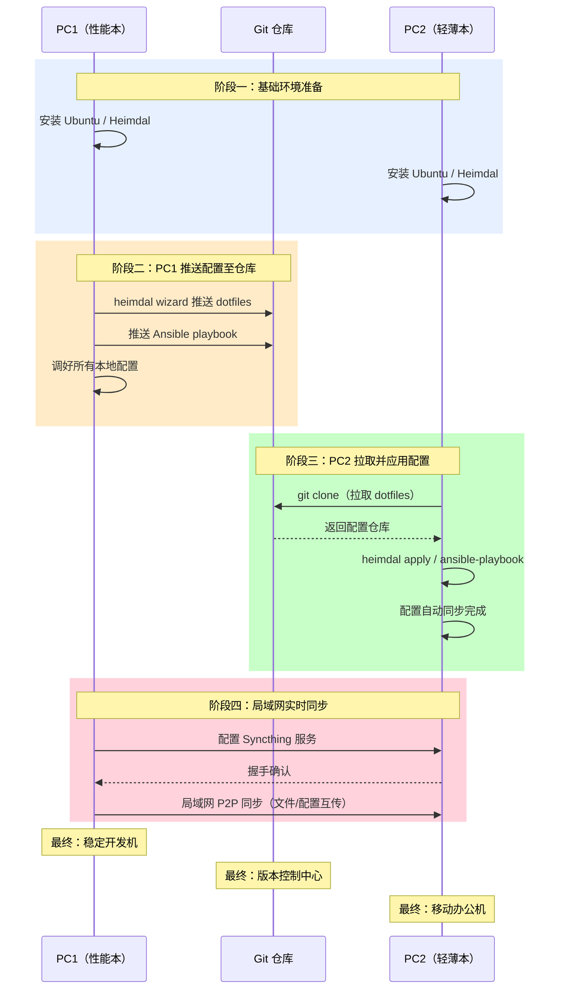

## 一、工具介绍

### 1. Heimdal —— 配置管理核心

Heimdal 是一个用 Rust 编写的通用 dotfile 和系统配置管理工具。它能帮你：
- **管理配置文件**：自动把配置文件（如 `.bashrc`、`.vimrc`）软链接到正确位置
- **安装软件包**：统一管理 APT、Homebrew 等多种包管理器
- **模板系统**：支持按机器名生成不同配置
- **Git 同步**：配置全部用 Git 版本控制

> 简单说：你在 PC1 上把软件和配置都调好，Heimdal 会帮你“记录”下来，然后在 PC2 上一键“重现”。

### 2. Ansible —— 系统自动化安装

Ansible 是一个自动化运维工具，无需在被控机器上安装额外软件，通过 SSH 执行任务，用 YAML 文件定义配置。

用它来定义 PC2 需要安装哪些系统软件包和基础设置。和 Heimdal 的区别是：**Heimdal 管“配置文件”**，**Ansible 管“软件包安装”**。

### 3. Syncthing —— 工作文件同步

Syncthing 是一个点对点的文件同步工具，不需要中心服务器，通信加密。用来同步 `~/Documents`、`~/Projects` 等工作目录，在一台电脑上修改，另一台自动同步。

---

## 二、准备工作

在开始前，确认以下事项：

| 项目          | 说明                                                 |
| ------------- | ---------------------------------------------------- |
| PC1（性能本） | 先完整安装 Ubuntu，把所有软件和配置调好              |
| PC2（轻薄本） | 只安装基础 Ubuntu 系统即可                           |
| Git 仓库      | 在 GitHub/GitLab 上创建一个私有仓库，用来存 dotfiles |
| 网络          | 两台电脑最好在同一局域网，方便 Syncthing 高速同步    |

---

## 三、第一步：在 PC1 上配置好完整环境

### 3.1 安装 Heimdal

在 PC1 终端执行：

```bash
# 一行命令安装
curl -fsSL https://raw.githubusercontent.com/limistah/heimdal/main/scripts/install-deb.sh | bash
```

或者手动安装：

```bash
curl -fsSL https://limistah.github.io/heimdal/gpg | sudo gpg --dearmor -o /usr/share/keyrings/heimdal-archive-keyring.gpg
echo "deb [signed-by=/usr/share/keyrings/heimdal-archive-keyring.gpg] https://limistah.github.io/heimdal/deb stable main" | sudo tee /etc/apt/sources.list.d/heimdal.list
sudo apt update && sudo apt install heimdal
```

验证安装：`heimdal --version`

### 3.2 用 Heimdal 初始化 dotfiles 仓库

```bash
# 运行交互式向导
heimdal wizard
```

向导会引导你：
- 扫描现有配置文件
- 选择要纳入管理的文件和软件包
- 自动生成 profile 名称（基于主机名）
- 配置 Git 远程仓库

完成后，你的配置文件会被整理到 `~/.dotfiles` 目录，并关联到你的 Git 仓库。

### 3.3 提交并推送到远程仓库

```bash
cd ~/.dotfiles
git add .
git commit -m "Initial dotfiles setup"
git push origin main
```

### 3.4 编写 Ansible Playbook（可选但推荐）

创建一个目录来存放 Ansible 配置：

```bash
mkdir ~/ansible-setup
cd ~/ansible-setup
```

创建 `playbook.yml` 文件：

```yaml
---
- name: Setup development environment
  hosts: localhost
  connection: local
  become: yes
  tasks:
    - name: Update apt cache
      apt:
        update_cache: yes
        cache_valid_time: 3600

    - name: Install essential packages
      apt:
        name:
          - git
          - vim
          - curl
          - wget
          - build-essential
          - python3-pip
          - docker.io
          - docker-compose
          - htop
          - tmux
          # 在这里添加你需要的所有软件包
        state: present

    - name: Install Docker Compose (alternative if needed)
      pip:
        name: docker-compose
        state: present
```

在 PC1 上先测试运行：

```bash
sudo apt update
sudo apt install ansible
ansible-playbook playbook.yml
```

确认所有软件都正确安装后，把这个 `playbook.yml` 文件也加到 dotfiles 仓库里（或者单独建一个仓库）。

---

## 四、第二步：在 PC2 上部署环境

### 4.1 安装基础工具

在 PC2 上：

```bash
# 安装 Git（如果还没有）
sudo apt update && sudo apt install git curl -y

# 安装 Heimdal（同 PC1）
curl -fsSL https://raw.githubusercontent.com/limistah/heimdal/main/scripts/install-deb.sh | bash
```

### 4.2 克隆 dotfiles 并应用配置

```bash
# 克隆你的 dotfiles 仓库
git clone <你的-dotfiles-仓库-URL> ~/.dotfiles

# 进入目录并应用配置
cd ~/.dotfiles
heimdal apply
```

Heimdal 会自动：
- 把所有配置文件软链接到正确位置（如 `~/.bashrc`）
- 安装 `heimdal.yaml` 中声明的软件包

### 4.3 运行 Ansible Playbook 安装系统软件

```bash
# 先把 playbook 同步过来（可以用 Git 克隆，或者用 scp 拷贝）
# 假设你已经把 playbook.yml 放到了 PC2 上

sudo apt update
sudo apt install ansible -y
ansible-playbook playbook.yml
```

### 4.4 处理硬件差异

PC1 是游戏本（独显），PC2 是轻薄本（集显），显卡驱动不能同步。Heimdal 的模板功能可以解决。

在 `~/.dotfiles` 中创建模板文件，例如 `~/.dotfiles/templates/bashrc.tmpl`：

```bash
# 通用 bash 配置
export EDITOR=vim


# PC1 专属：CUDA 路径
export PATH=/usr/local/cuda/bin:$PATH



# PC2 专属：省电模式
export POWER_SAVE=1

```

Heimdal 会在 apply 时根据当前机器的主机名渲染出正确的 `.bashrc`。

---

## 五、第三步：用 Syncthing 同步工作文件

### 5.1 在两台电脑上安装 Syncthing

```bash
sudo apt update && sudo apt install syncthing -y
```

### 5.2 启动并访问 Web 管理界面

在两台电脑上分别运行：

```bash
syncthing
```

第一次运行会自动生成配置，并在浏览器打开 `http://localhost:8384` 的管理界面。

### 5.3 设置开机自启（建议）

```bash
# 启用用户级服务
systemctl --user enable syncthing
systemctl --user start syncthing
```

### 5.4 连接两台设备

1. 在 PC1 的 Web 界面右上角点击 **"Add Remote Device"**
2. 输入 PC2 的设备 ID（在 PC2 的 Web 界面右上角可以看到，一串很长的字母数字）
3. 同样在 PC2 上添加 PC1 的设备 ID

> 如果两台电脑在同一局域网，会自动通过局域网高速同步。

### 5.5 添加同步文件夹

在 PC1 上：
1. 点击 **"Add Folder"**
2. 选择要同步的目录（如 `~/Documents`、`~/Projects`）
3. 在 **"Sharing"** 标签下勾选 PC2
4. 点击保存

在 PC2 上会收到共享文件夹的提示，接受即可。之后任何一方修改文件，另一方会自动同步。

---

## 六、日常使用流程

| 场景                      | 操作                                                         |
| ------------------------- | ------------------------------------------------------------ |
| **在 PC1 上修改了配置**   | `cd ~/.dotfiles && git add . && git commit -m "xxx" && git push` |
| **在 PC2 上拉取最新配置** | `cd ~/.dotfiles && git pull && heimdal apply`                |
| **在 PC1 安装了新软件**   | 更新 `playbook.yml`，推送到 Git；PC2 上 `git pull && ansible-playbook playbook.yml` |
| **工作文件同步**          | Syncthing 自动同步，无需手动操作                             |

---

## 七、总结流程图



按照这个流程操作下来，PC1 是你的稳定开发基地，PC2 是随时可用的移动办公室。两边配置统一，工作文件自动同步，硬件差异通过模板优雅处理。