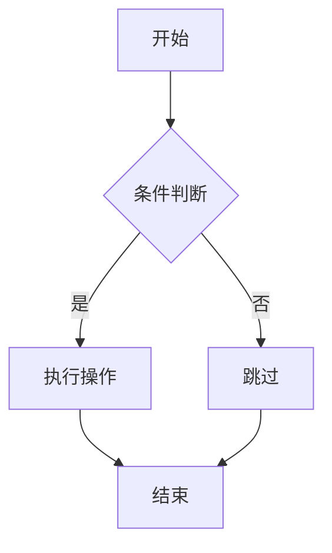

# Markdown 格式测试文档

本文档覆盖 Markdown 全部常用格式，用于测试解析渲染效果。

## 1. 标题层级

# 一级标题 H1
## 二级标题 H2
### 三级标题 H3
#### 四级标题 H4
##### 五级标题 H5
###### 六级标题 H6

## 2. 文本样式

这是**粗体**文本，这是*斜体*文本，这是***粗斜体***文本，这是~~删除线~~文本，这是`行内代码`。

You can also use __bold__ and _italic_ in underscore style.


## 3. 列表


### 3.1 无序列表

- 第一项
- 第二项
  - 嵌套项 2.1
  - 嵌套项 2.2
    - 三级嵌套
- 第三项

也可以使用 `*` 或 `+`：

* 星号列表项
* 另一项

+ 加号列表项
+ 另一项

### 3.2 有序列表

1. 第一项
2. 第二项
   1. 嵌套项 2.1
   2. 嵌套项 2.2
3. 第三项

### 3.3 任务列表

- [x] 已完成任务
- [ ] 未完成任务
- [x] ~~已废弃的任务~~

## 4. 引用

> 这是一层引用。
>
> 引用可以包含多个段落。
>
> > 这是嵌套引用。
> >
> > > 这是三级嵌套引用。

> 引用中可以包含其他格式：
>
> - 列表项
> - **粗体文本**
>
> ```python
> print("引用中的代码块")
> ```

## 5. 代码块

### 5.1 围栏代码块（带语言标注）

```python
def hello_world():
    """这是一个 Python 函数"""
    name = input("请输入你的名字：")
    print(f"你好，{name}！")
    return name
```

```javascript
const greet = (name) => {
  // 这是 JavaScript
  console.log(`Hello, ${name}!`);
  return name;
};
```

```bash
#!/bin/bash
# 这是 Shell 脚本
echo "Hello, World!"
```

```json
{
  "name": "测试",
  "version": "1.0.0",
  "dependencies": {
    "vitepress": "^1.0.0"
  }
}
```

```css
/* 这是 CSS */
.container {
  display: grid;
  grid-template-columns: 1fr 4.5fr 1.3fr;
  max-width: 1440px;
}
```

```html
<!-- 这是 HTML -->
<div class="container">
  <h1>Hello World</h1>
</div>
```

```text
这是纯文本代码块，没有语言标注。
文字不会被高亮。
```

### 5.2 缩进代码块

    这是缩进代码块（四个空格）。
    用于旧的 Markdown 风格。
    换行保留。

## 6. 链接

### 6.1 内联链接

[GitHub](https://github.com)

### 6.2 带标题的链接

[Google](https://www.google.com "Google 搜索引擎")

### 6.3 引用式链接

[引用链接][ref]

[ref]: https://example.com "示例网站"

### 6.4 自动链接

<https://www.example.com>

<user@example.com>

### 6.5 锚点链接

[跳转到标题层级](#1-标题层级)

## 7. 图片

### 7.1 内联图片


### 7.2 引用式图片

![引用式图片][img-ref]

[img-ref]: https://via.placeholder.com/200x150.png?text=Ref+Image

### 7.3 带链接的图片

[](https://example.com)

## 8. 表格

### 8.1 基本表格

| 左对齐 | 居中对齐 | 右对齐 |
|:---|:---:|---:|
| 单元格 | 单元格 | 单元格 |
| 数据 A | 数据 B | 数据 C |

### 8.2 复杂表格

| 功能 | 语法 | 示例 | 备注 |
|------|------|------|------|
| 粗体 | `**text**` | **粗体** | 常用 |
| 斜体 | `*text*` | *斜体* | 常用 |
| 代码 | `` `code` `` | `code` | 行内 |
| 链接 | `[text](url)` | [链接](https://example.com) | 内联式 |

## 9. 分隔线

---

下面是另一条分隔线（使用星号）：

***

使用下划线：

___

## 10. 脚注

这是一个带脚注的句子。[^1]

[^1]: 这是脚注内容。

另一个脚注。[^long-note]

[^long-note]: 这是一个**长脚注**，可以包含多个段落和格式。

    在脚注中缩进可以创建新段落。

## 11. HTML 内嵌

### 11.1 基本 HTML

<div style="border: 1px solid #ccc; padding: 10px; border-radius: 4px;">
  <p>这是一个 <strong>HTML</strong> 块。</p>
</div>

### 11.2 折叠/详情

<details>
  <summary>点击展开更多内容</summary>

  这里是折叠的内容。

  ```python
  print("折叠区域内的代码块")
  ```

  - 列表也可以
  - 在折叠区域内
</details>

### 11.3 键盘标签

使用 <kbd>Ctrl</kbd> + <kbd>C</kbd> 复制，<kbd>Ctrl</kbd> + <kbd>V</kbd> 粘贴。

### 11.4 上下标

H<sub>2</sub>O 是水，E = mc<sup>2</sup> 是质能方程。

### 11.5 高亮标记

<mark>这段文字被高亮标记</mark>。

## 12. 转义字符

\*星号不被解析为斜体\*

\# 井号不被解析为标题

\` 反引号不被解析为代码

\\ 反斜杠本身

\> 大于号不被解析为引用

\[ 方括号不被解析为链接

## 13. 表情符号 / Emoji

:smile: :heart: :rocket: :warning: :heavy_check_mark: :x:

## 14. 缩写（如果支持）

*[HTML]: Hyper Text Markup Language
*[CSS]: Cascading Style Sheets

HTML 和 CSS 是网页技术的基础。

## 15. 定义列表（如果支持）

<dl>
  <dt>Markdown</dt>
  <dd>一种轻量级标记语言，用于格式化纯文本。</dd>

  <dt>VitePress</dt>
  <dd>基于 Vite 和 Vue 的静态站点生成器。</dd>
</dl>

## 16. 数学公式（如果支持 LaTeX）

行内公式：$E = mc^2$

块级公式：

$$
\sum_{i=1}^{n} x_i = x_1 + x_2 + \cdots + x_n
$$

$$
\int_{0}^{\infty} e^{-x^2} dx = \frac{\sqrt{\pi}}{2}
$$

## 17. Mermaid 图表（如果支持）



## 18. 长段落与换行

这是一段很长的普通文本，用于测试段落内的文本换行和渲染效果。Markdown 会将连续的文本行合并为一个段落，除非在行末使用两个空格进行强制换行。  
这一行前面有强制换行（两个空格）。

两个换行会创建新的段落。

## 19. 特殊字符与 Unicode

- 版权符号：©
- 注册商标：®
- 商标符号：™
- 人民币：¥
- 欧元：€
- 英镑：£
- 度数：90°
- 省略号：……
- 破折号：——

## 20. VitePress 自定义容器（如果主题支持）

::: tip
这是一个提示框。
:::

::: warning
这是一个警告框。
:::

::: danger
这是一个危险提示框。
:::

::: info
这是一个信息框。
:::

::: details 自定义折叠
这是自定义折叠内容。
:::

## 21. 混合场景测试

### 21.1 列表中包含代码块

1. 第一步：安装依赖

   ```bash
   npm install vitepress
   ```

2. 第二步：启动开发服务器

   ```bash
   npm run docs:dev
   ```

3. 第三步：打开浏览器访问 `http://localhost:5173`

### 21.2 引用中包含表格

> | 列 A | 列 B |
> |------|------|
> | 值 1 | 值 2 |
> | 值 3 | 值 4 |

### 21.3 表格中包含多种格式

| 格式 | 示例 |
|------|------|
| 粗体 | **bold** |
| 代码 | `code` |
| 链接 | [link](https://example.com) |
| 图片 |  |

---

**文档结束。**
